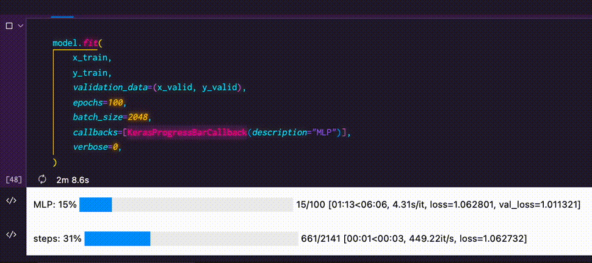

プログレスバーで表示するシリーズ第三弾はKeras！

学習の進捗を`tqdm`でかっこよく表示するスニペットを紹介するよ。

<video autoplay loop muted playsinline>
    <source src="./keras-tqdm.webm" type='video/webm; codecs="vp9"' />
    <source src="./keras-tqdm.mp4" type='video/mp4; codecs="avc1"' />
    
</video>

TensorBoardも超いいけどこういうシンプルな進捗表示もアリだよね。

<InfoBox title='これまでのプログレスバーシリーズ'>

- [LightGBMの進捗をプログレスバーで表示する](./lightgbm-with-progress-bar)
- [Joblibの進捗をプログレスバーで表示する](./joblib-with-progress-bar)

</InfoBox>

<InfoBox title='TensorFlowのバージョン'>

`2.7.0`

</InfoBox>

## インストール

`tqdm`のインストールがまだの人はインストールしておこう。

```shell
pip install tqdm
```

## スニペット

単なる関数じゃなくて`keras.callbacks.Callback`を継承したクラスを作るのがポイント。

`epoch`と`step`それぞれに対して2つプログレスバーを表示しているよ。

```python
from typing import Dict, Optional
from collections import OrderedDict
from tensorflow import keras
from tqdm.auto import tqdm

class KerasProgressBarCallback(keras.callbacks.Callback):
    description: Optional[str]
    pbar_epoch: tqdm
    pbar_step: tqdm

    def __init__(self, description: Optional[str] = None):
        self.description = description
        self.pbar_epoch = tqdm(desc=self.description)
        self.pbar_step = tqdm(desc="steps")

    def __update_postfix(self, pbar: tqdm, logs: Dict[str, float]):
        postfix = OrderedDict([(key, str(value)) for key, value in logs.items()])
        pbar.set_postfix(ordered_dict=postfix, refresh=False)

    def on_train_begin(self, logs={}):
        total_epoch = self.params.get("epochs")
        total_step = self.params.get("steps")
        self.pbar_epoch.reset(total=total_epoch)
        self.pbar_step.reset(total=total_step)

    def on_train_end(self, logs={}):
        self.pbar_epoch.close()
        self.pbar_step.close()

    def on_epoch_begin(self, epoch, logs={}):
        self.pbar_step.reset()

    def on_epoch_end(self, epoch, logs={}):
        self.__update_postfix(self.pbar_epoch, logs)
        self.pbar_epoch.update(1)

    def on_batch_end(self, step, logs={}):
        self.__update_postfix(self.pbar_step, logs)
        self.pbar_step.update(1)
```

`on_*_{begin,end}`の形式でタイミングに従ったメソッドが呼ばれるからそこにプログレスバーを制御するコードを差し込んでいく感じ。

<InfoBox title='カスタムコールバック'>

`on_predict_batch_begin`みたいに推論時に動くフックも書けたりするよ。

カスタムコールバックについては[このページ](https://keras.io/guides/writing_your_own_callbacks)に詳しく載ってるからチェックしてみてね。

[Writing your own callbacks](https://keras.io/guides/writing_your_own_callbacks)

</InfoBox>

## 使い方

`fit()`する時の`callbacks`オプションに渡して使う。

```python
model.fit(
    x_train,
    y_train,
    validation_data=(x_valid, y_valid),
    epochs=100,
    batch_size=2048,
    callbacks=[KerasProgressBarCallback(description="MLP")],
    verbose=0,
)
```

デフォルトの出力は必要ないから`verbose=0`を指定しよう。
