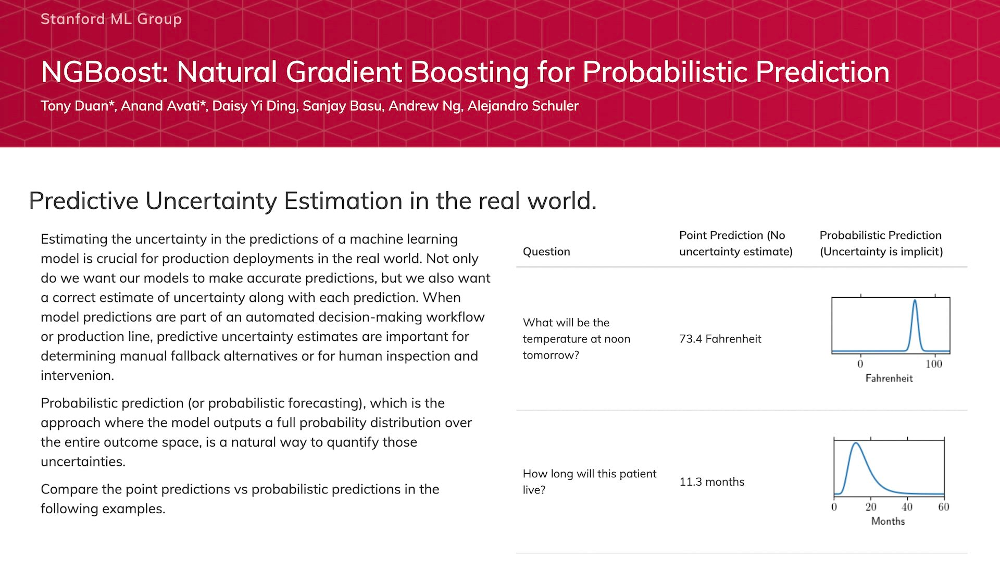
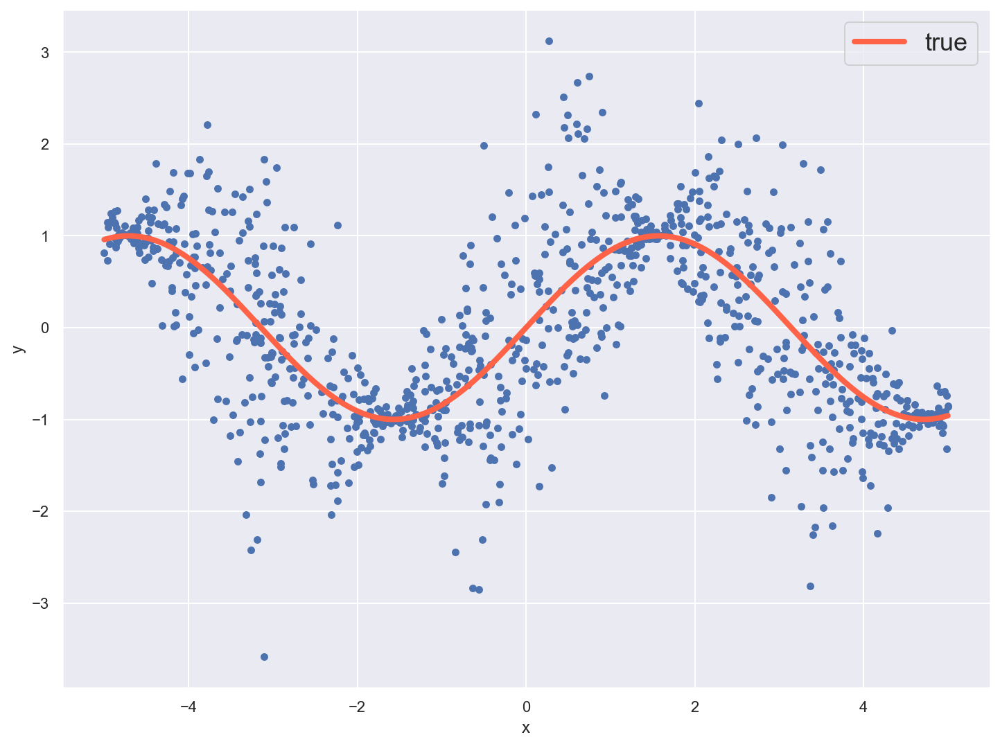
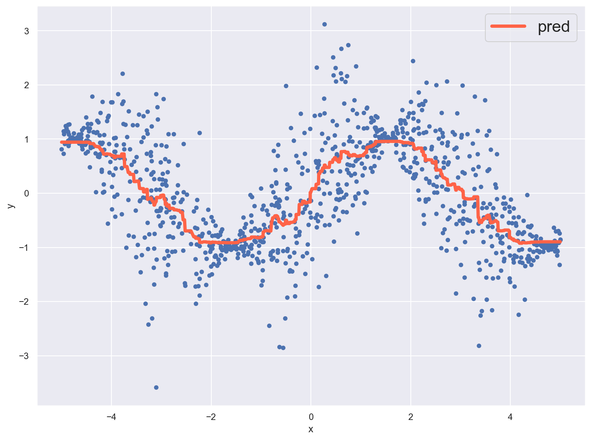
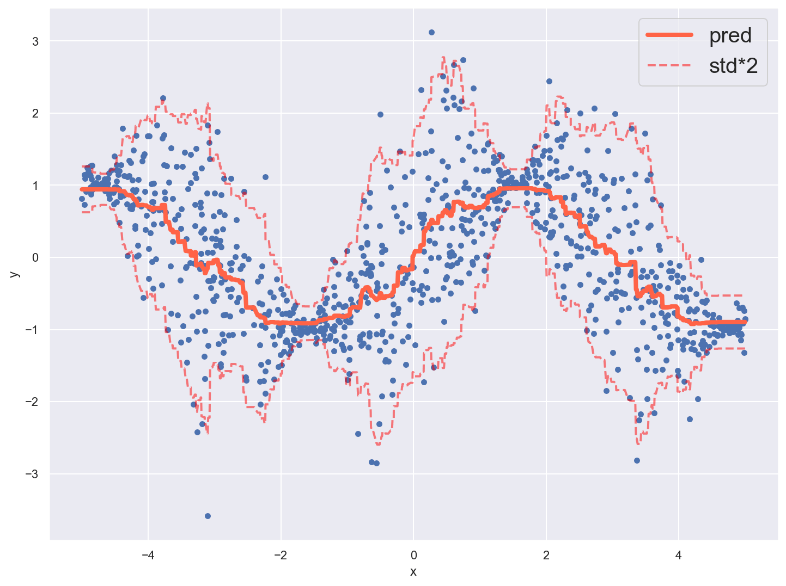
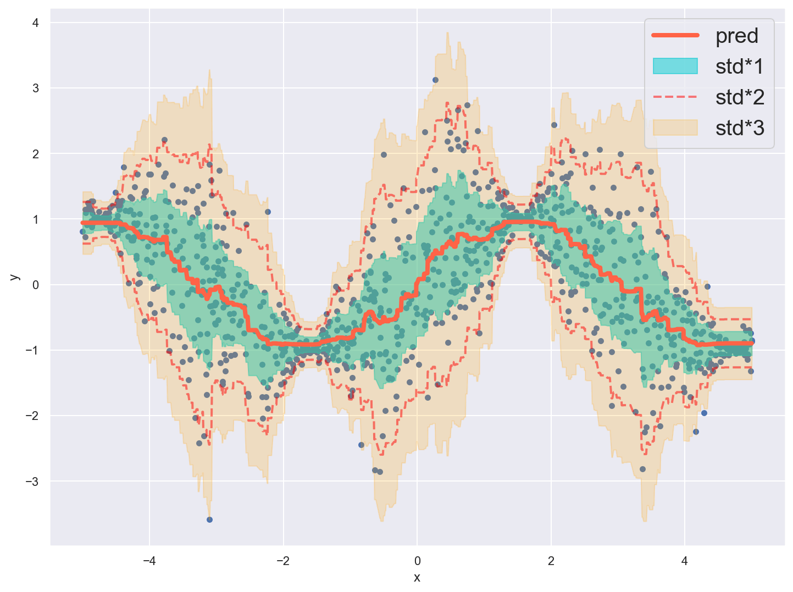
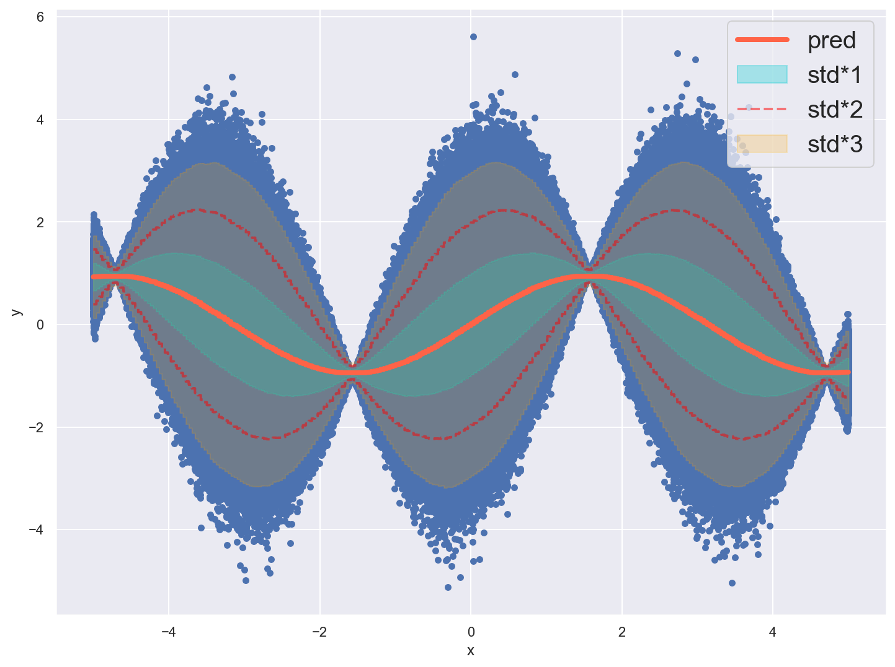

最近[NGBoost](https://stanfordmlgroup.github.io/projects/ngboost)というものがあることを知った。

勾配ブースティングをしつつ同時に予測区間も推定することで予測の不確かさを扱えるということらしい。

[NGBoost: Natural Gradient Boosting for Probabilistic Prediction](https://stanfordmlgroup.github.io/projects/ngboost)

[](https://stanfordmlgroup.github.io/projects/ngboost)

LightGBMやXGBoostだと出力値が点になるところ、NGBoostでは範囲を出力できるようになる感じ。

確かに出力値に加えて「似ている過去データはほぼこの値に収まってるのでかなり自信あります！」とか「似てる過去データがあまりないし値の分散も大きいので参考値程度です！」とかそういうのも知れるとすごく便利な場面がありそう。

しかもそれが勾配ブースティングしつつ得られるなんて凄い！

<NoteBox title="予測区間を得られるモデル">

予測値に加えて予測区間的な情報を得られる手法だとベイズ系のモデルが思い浮かぶけど、計算コストがかなり大きい割に単純な予測器としての精度が低くなりがちなんだよね。

天気予報みたいに予測区間を得ることの価値が大きい場面では有用だけど勾配ブースティングみたいに大きなデータに対して精度をチューニングしていきたい文脈では応用しにくいイメージがある。

</NoteBox>

…と思ったんだけど実際に配布されてるNGBoostのライブラリ自体はシンプルな理論実装の側面が強いみたいで、LightGBMやXGBoostにあるような正則化, 大規模データ対応, GPU利用などの実務上ほぼ必須な便利機能がないみたい。

さらに精度も既存の勾配ブースティング系のライブラリには劣るようで、やっぱりそのままだとイマイチ使いにくそうだ。

そこで逆にNGBoostでやってる区間推定の仕組みの方を既存のライブラリに応用できないかと思って論文を読んでみた。

[NGBoost: Natural Gradient Boosting for Probabilistic Prediction](https://arxiv.org/pdf/1910.03225.pdf)

うーん、案の定難しくてよくわからない😇笑

けどこれって結局予測値の条件付き分散も同時に推定しているようなことだよね？

だとしたらちょっと工夫すればLightGBMでも同様の結果を得ることが出来る気がする。

既存のイケてる勾配ブースティングで予測区間も出せたら超アツいよね！？試してみよう！

## アイデア

まずNGBoostの主なポイントはこの2つだと思ってて。それぞれLightGBMで再現できれば同じ結果が得られる…はず。

1. 自然勾配を使う
2. 予測値の学習と同時に分布のパラメータも推定する

### 自然勾配を使う

自然勾配は多分アルゴリズムを一般化するために使っているのだと思うんだけど、LightGBMの場合は確かニュートン法で勾配ブースティングしてるはずだからここは無視しても大丈夫?な気がする。

何て言ったらいいかよく分からないけどこの場合は特に考慮に入れなくても結局同じようなことになる感じがする。

> When the probability distribution is in the exponential family and the choice of parameterization is the natural parameters of that family, then a NewtonRaphson step is equivalent to a natural gradient descent step.

と思ったら元論文にもこう書いてあったしとりあえず考えないで良さそう。そういうことにしておく。

### 予測値の学習と同時に分布のパラメータも推定する

NGBoostは予め予測値の分布の種類を仮定した上でモデルから得られた予測値と目的変数に対して最もそれっぽくなる分布のパラメータを推定することで予測区間を出力できるようにしてるんだよね。(多分)

合ってるかどうか全然自信ないんだけど…例えば既に学習済みのモデルがあるとして、モデルが出力した`予測値p`と`目的変数y`の関係から予測区間を割り出すことを考える。

分布には正規分布を仮定すると、パラメータは`平均μ`と`分散σ`の2つだよね。

ここで`平均μ`が`予測値p`である分布の中に`目的変数y`があるとした時、pとyがめっちゃずれてたらこの正規分布は横に長い(`分散σ`が大きい)と考えるのが妥当そうだよね。

逆にpとyがほぼ同じだったらこの正規分布は超尖ってて良さそうだから`分散σ`は小さいと考えるのが妥当そう。

こんな感じでモデルの予測値を元に`分散σ`がどんな値だったら一番それっぽい分布になるかっていうのを考えられそう。

しかもこの`分散σ`は当然容易に予測できるイージーな`説明変数x`の時は小さくなりそうだし、誤差が出ちゃいそうな難しい`説明変数x`の時は大きくなりそうだよね。

ってことでこの`分散σ`をxの関数だと考えて、モデルにxを入力すると一番それっぽい`分散σ`を返すように学習させることで予測区間の推定を行えるようにする、っていうことみたい。(多分)

これをLightGBMで実現するためには目的関数として分布の当てはまり度を表現できるものを使えば良いってことになりそう。例えば対数尤度関数とか？

つまり仮定した分布の対数尤度関数を目的関数にしてパラメータを学習させればLightGBMでもNGBoost出来る…？

## 実際に試してみる

手始めに実際に正規分布を仮定した時にちゃんとパラメータを学習できるのか検証してみよう。

上に書いたように正規分布には`平均`と`分散`2つのパラメータがあるよね。

ここではモデルの予測値を`平均`とした時の`分散`を学習させたいわけだから、2段階に分けてモデルを学習させていくことにする。

まず1つ目はベースとなる予測モデル、2つ目がベースモデルの予測値の区間推定モデル。

ベースモデルの出力値を`平均`とした時の`分散`を区間推定モデルに学習させる感じ。

### データの用意

適当な学習データとしてsin関数に対して正規分布からサンプルしたノイズを乗せたものを作ってみた。

赤い線がベースのsin関数、青い点がノイズを付加したもの。関数の凹凸部分でだけノイズの分散が小さくなるようにしてある。

青い点を目的変数として学習した後にソーセージみたいな形の分散も学習してほしいところ…！

```python
def obj(x: np.ndarray):
    return np.sin(x)

def noise(x: np.ndarray):
    return np.abs(np.cos(x))
```

```python
n_samples = 1000
x = np.random.uniform(-5, 5, n_samples).reshape((n_samples, 1))
t = obj(x[:,0])
y = t + np.random.normal(scale=noise(x[:,0]), size=n_samples)
```



### 予測モデルの学習

まずベースの予測モデルとして普通にシンプルなregressionモデルを作る。

```python
params = {
    "objective": "regression",
    "learning_rate": 0.01,
    "lambda_l1": 1.0,
    "lambda_l2": 1.0,
    "bagging_fraction": 0.5,
    "bagging_freq": 1,
}
```

```python
booster = lgbm.train(
    params,
    lgbm.Dataset(x, y),
    num_boost_round=300,
)

y_pred = booster.predict(x)
```

うん、まぁこれはこんな感じだよね。



### 区間推定モデルの学習

続いて予測モデルの出力値を使って区間推定モデルを作っていく。

と言っても目的関数を差し替えるだけなんだけどね。

正規分布の確率密度関数を対数分散で偏微分しているつもり。

```python
def norm_likelihood_obj(log_var: np.ndarray, data: lgbm.Dataset):
    y_true = data.get_label()
    grad = 1 - (y_pred - y_true) ** 2 / np.exp(log_var)
    hess = (y_pred - y_true) ** 2 * np.exp(-1 * log_var)
    return grad, hess
```

```python{5}
booster_var = lgbm.train(
    params,
    lgbm.Dataset(x, y),
    num_boost_round=300,
    fobj=norm_likelihood_obj,
)

log_var_pred = booster_var.predict(x)
std_pred = np.sqrt(np.exp(log_var_pred))
```

得られた分散から標準偏差を求めて、予測値に対して標準偏差2つ分の区間も一緒にプロットしてみる。

果たしてちゃんと学習できてるのか…？



**え、めっちゃ良さそう！！**

めっちゃソーセージっぽくなってる！良さそうすぎじゃない！？ 調子に乗って標準偏差1つ分, 3つ分も併せてプロットしてみる。



**最高かよ**

見事に区間を推定できてる感じがする！思いつきのアイデアにしては良い感じの結果が得られたみたい。

むしろ本当にこれで大丈夫なのか…？基礎的な学力が無さすぎて自信が持てないのが歯痒い…😇

<WarnBox title="予測区間について">

こうしてプロットしてみると予測区間はここにn%の確率で真の値が入ってますよという信頼区間的なものに感じてしまうけど、それは違うらしい。

予測区間は信頼区間ではなくモデルが判断する相対的な区間とのこと。[それについて論文の筆者が書いた記事](https://towardsdatascience.com/interpreting-the-probabilistic-predictions-from-ngboost-868d6f3770b2)を読んでみたけど難しい…

モデルがデータから学習したケースによると考えうる限り相対的にn%の確率でここに入るはずだと判断している区間に過ぎず、あくまでモデルの主観でしかないから精度に依存するし統計的な信頼区間とは意味が異なるよという感じ？

まぁ機械学習をやってると普段から「sigmoidやsoftmaxの出力値みたいに0~1の範囲をとるため直接確率としても扱えてしまう値をそのまま確率として扱う」っていうことをよくすると思うんだけど、そういうノリで扱ってねっていうことだと理解してる。

モデルの予測値っていうと普通にモデルに依存する値だと分かりやすいけど、区間っていうと何かしらの信頼区間をイメージしちゃいがちだもんね。

[NGBoost and Prediction Intervals](https://towardsdatascience.com/interpreting-the-probabilistic-predictions-from-ngboost-868d6f3770b2)

</WarnBox>

### 大量のデータで試す

学習データがもっと大量にあったらどうなるんだろう？試しに1000万個に増やして学習させてみた。



見事なソーセージ！笑

標準偏差1~3個分それぞれの区間のカバー率も算出してみる。

```python
def cover_ratio(band: int):
    lower_cond = y_pred - std_pred * band < y
    upper_cond = y < y_pred + std_pred * band
    return np.where(lower_cond & upper_cond, 1, 0).mean()

print(cover_ratio(1))
print(cover_ratio(2))
print(cover_ratio(3))
```

```python
0.6873332
0.9585959
0.9976872
```

俗に言う正規分布の3シグマの割合`68.27%` `95.45%` `99.73%`に近似した数字になってるね。

でもこれって多分そもそもデータに与えた誤差が正規分布からサンプルしたものだから綺麗に近似するっていう話で、誤差の分布が異なる時は結果も変わってくるよね？

### 指数分布で試す

誤差のサンプル元を正規分布から指数分布に変えて試してみた。データ数は10万個。


やっぱり元の誤差が正規分布より尖った形をしているのに対して学習した分散は正規分布っぽい形になってるね。

各区間のカバー率も正規分布の時とはズレた数字になってる。

```python
print(cover_ratio(1))
print(cover_ratio(2))
print(cover_ratio(3))
```

```python
0.75364
0.94218
0.9864
```

誤差に対して適切な分布を仮定することが大事っぽいね。

### metricがほしい時

上の例ではシンプルに目的関数だけ差し替えてるけど評価関数もないと不便だよね。

学習の経過が見たい時やEarlyStoppingしたい時にmetricとして使える負の対数尤度関数はこんな感じ。

```python
from scipy.stats import norm

def norm_likelihood_metric(log_var: np.ndarray, data: lgbm.Dataset):
    y_true = data.get_label()
    std = np.sqrt(np.exp(log_var))
    return "likelihood", (-1 * norm.logpdf(y_true, loc=y_pred, scale=std)).mean(), False
```

```python{2,5,7-8}
booster_var = lgbm.train(
    {**params, "metric": "None"},
    lgbm.Dataset(x, y),
    num_boost_round=300,
    valid_sets=lgbm.Dataset(x, y),
    fobj=norm_likelihood_obj,
    feval=norm_likelihood_metric,
    callbacks=[lgbm.log_evaluation(10)],
)

# [10]  valid_0's likelihood: 0.97747
# [20]  valid_0's likelihood: 0.888859
# [30]  valid_0's likelihood: 0.832512
# [40]  valid_0's likelihood: 0.792482
# [50]  valid_0's likelihood: 0.767082
# [60]  valid_0's likelihood: 0.746711
# [70]  valid_0's likelihood: 0.731189
# [80]  valid_0's likelihood: 0.717998
# [90]  valid_0's likelihood: 0.707742
# [100] valid_0's likelihood: 0.699712
```

## まとめ

思いついてぱっとやってみたら何か良い感じっぽくなってしまってびっくりした。

元のNGBoostと同じことが出来ているのか、自分の頭ではこれ以上すぐには分からないのが悔しい…

補足とか間違っているところとか何かあれば是非教えて下さい！

自分でももうちょっと深掘りしてみよう。他の分布も学習できるのか試してみたい。

特に正規分布は`平均`→`分散`と順番に最適化できるから今回のアプローチが出来たけど、複数のパラメータを同時に最適化する必要がある分布はどうすればいいんだろう。

`num_class`を指定した上でダミーのラベルを与えつつダミーは無視して勾配を計算するとか、複数モデルの状態を共有できる目的関数を作るとか、ちょっとトリッキーな仕組みにせざるをえない気がするなぁ。

逆にパラメータが単一の分布に対しては割と簡単に拡張していけそうだね。

また何か分かれば記事にするね！
