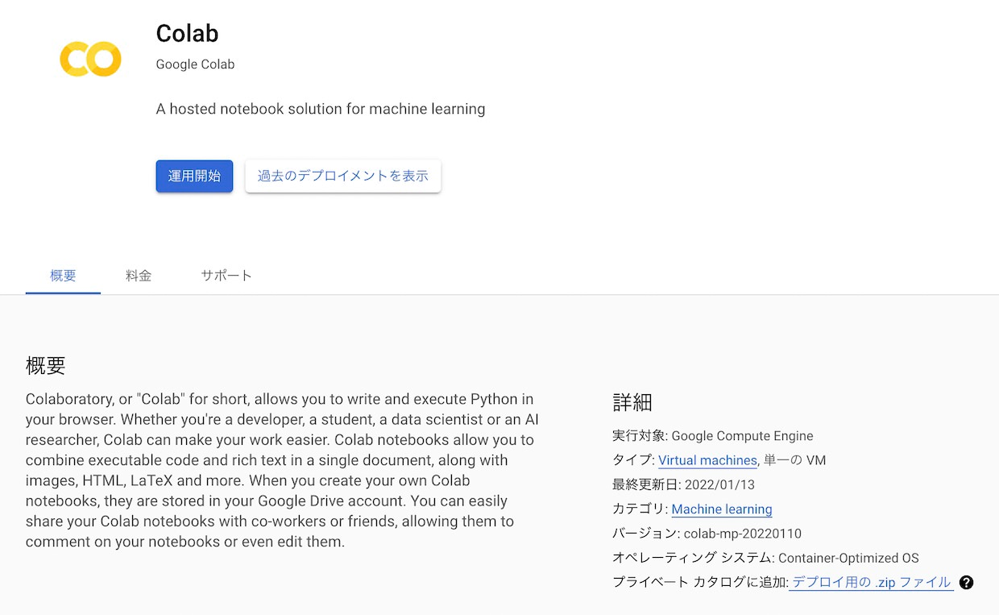
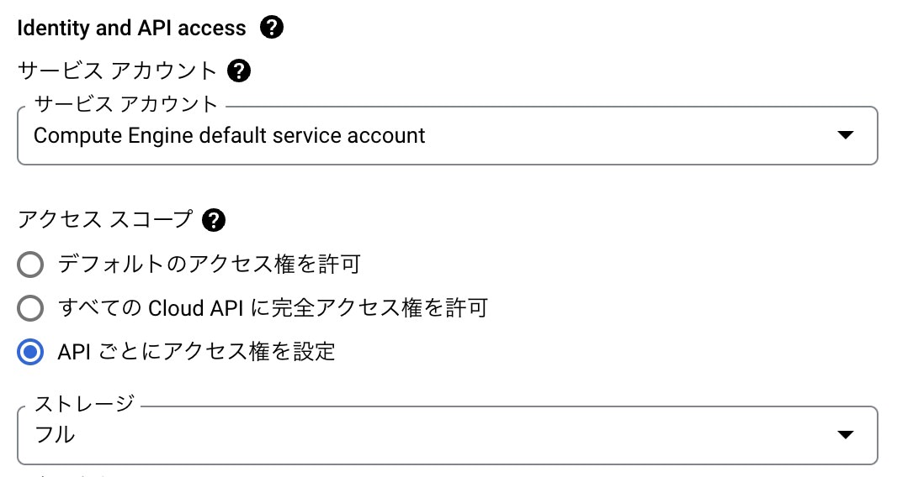

Google Colaboratory本当に便利だよね。

ブラウザから接続するだけですぐに使い始められるしGoogleDriveとシームレスに連携するし、無料プランでもGPUが使えるし。

Node.jsでWeb開発する時のノリと違ってPython × データサイエンス系の環境構築ってどうしてもネイティブライブラリ周りのあれこれと向き合う必要が出てきがちだけど、そういうのすっ飛ばしてすぐにコードを書き始められるところも最高。

特に入門者向けの環境導入が超絶楽になるし「まずコラボで始めてみてから~」みたいなケースも超多そう。

最近は月額5000円ぐらいでメモリ50GBに加えてバックグラウンド実行が出来るようになったPro+プランも出たね。
ブラウザ閉じても回り続けてくれるのが便利すぎて自分もめっちゃヘビーユースしてる。

メモリが50GB使えるとある程度本格的な規模のデータの処理も出来てしまうけど、そうすると逆にもうちょっとだけメモリがあれば全部コラボで回り切るのに！みたいなことない？

Pro+の範囲でリサーチは済ませてしまって、その後の本番の学習だけもう少しハイスペックなマシンで半日回したい。とか。

GCEに課金してもOKなら普通にVM立ててJupyter Notebookインストールしたりすれば似たような環境は全然実現出来ると言えば出来る。

でもどうせならコラボのUI上でポチポチ選択するだけで自動で時間課金のインスタンスがセットアップされる機能があればコラボ内で完結できて便利なのになーとずっと思ってたんだよね。

そしたらいつの間にか出来るようになっていた。どんどん便利になってくなー。

## 仕組み

コラボってFirebaseみたいに実際のインフラはGoogle Cloud Platform(GCP)というGoogleのクラウドサービスのものを使っていて、実態的にはGCPの余剰リソースを利用したインフラ構成とUIやGoogle Drive連携などの便利機能を切り出してパッケージングして提供してる感じなのね。

そんでカスタムVMというのは普通にコラボを使ってるだけだと隠蔽されているバックエンドのVMを自分でGCP上に立ち上げたVMに差し替えることが出来る機能。

だから実際ちょこっとだけGCPの管理画面からポチポチっと設定をする必要があるんだけど、まぁそれもめっちゃ簡単だった。

GCPには[Marketplace](https://console.cloud.google.com/marketplace/browse)というのがあってソリューション別に色んなGCP上のリソースを組み合わせた構成のレシピ的なものが配布されてる。

コラボ向けのカスタムVM用の構成もここから無料で導入出来て、実際にVMを使った時間に応じて課金が発生する仕組み。

[Colab - Marketplace](https://console.cloud.google.com/marketplace/product/colab-marketplace-image-public/colab)

[](https://console.cloud.google.com/marketplace/product/colab-marketplace-image-public/colab)

1. カスタムVMのスペックを選択してデプロイする
2. コラボのUIからセッションの接続先にデプロイしたVMインスタンスを指定する

これだけ。GCPの知識が全く無い人でも全然いけそう。

## 導入手順

### 0. プロジェクトの準備

まず大前提としてGCP上に支払い関連の設定が済んだプロジェクトが存在する必要があるんだけど、GCPを使うのが初めての人はまだ無いと思うから作っておこう。

[Google Cloud Platformのコンソール](https://console.cloud.google.com)にアクセスするとプロジェクトがありません的な文言と作成用のリンクが出てくると思う。プロジェクト名やIDは何でもいいけどIDは後で使うから控えておこう。

続いて請求先アカウントを設定して課金を有効にする。

<NoteBox title="請求先アカウント">

GCPにはカード情報など支払い用の設定が1まとめになった請求先アカウントという概念があって、各プロジェクトがどれか1つの請求先アカウントに紐づく仕組みになってる。

これは個人用のGoogleアカウントの支払い設定とは全く別のもので、既に個人のアカウントに支払い情報を設定済みでもGCP側であらためて設定する必要があるよ。

</NoteBox>

例えばFirebaseの無料プランみたいに特に支払いの設定をしなくても使える機能も色々あるんだけど、原則課金が発生する可能性がある機能はそもそも支払いの設定が済んでいないと使い始めることができないみたい。コラボのカスタムVMもそう。

GCPは初めて利用を開始する時に\$300ぐらいの無料クレジットをくれるからカスタムVMをちょっと試すだけなら実際に課金が発生することはないんだけどね。利用を開始するために支払いの設定自体は必要。

[ドキュメント](https://cloud.google.com/billing/docs/how-to/manage-billing-account#create_a_new_billing_account)を見ながら進めよう。プロジェクトに請求先アカウントがリンクできたら準備完了。

### 1. MarketplaceからColabをデプロイ

[マーケットプレイスのColabのページ](https://console.cloud.google.com/marketplace/product/colab-marketplace-image-public/colab)から運用開始を選択するとインスタンスのスペックを選択する画面になる。

自分のユースケースに沿った内容にしよう。デフォルトだとコラボの無料版とだいたい同等程度に設定されている感じだった。
`vCPU × 2` `メモリ 13GB` `T4 × 1` で**1時間あたり57円**ぐらい。**GPU無しだと16円**ぐらい。

カスタムVMを利用する場合はコラボのアイドル制限と1セッション24時間制限が適用されないから同列に比較は出来ないんだけど、制限があることを差し引いても無料版が結構太っ腹な内容だってことが分かるね。

注意点としてGCP初回利用時にもらえる**無料クレジットが残ってる状態**だと**GPUが使えない**上に**利用可能なvCPU数に上限が設定される**ことに気をつけよう。

お試し期間中は制限されるってことみたい。2022年2月の時点では `vCPU × 24` が設定可能な上限だった。

無料クレジットは残ってるけどGPUが使いたいって場合にクレジットを無視することって出来るのかな？少なくとも自分はその方法を知らず、とりあえずCPUで何日か回してクレジットを消化するぐらいしか思い浮かばない。もし知ってたら教えてね。

ただGCPのこういう利用上限って割とちょいちょい変わるからもしかしたら今だけかも。

設定できたらデプロイを選択。表示される進捗画面からインスタンス名とゾーンを控えておこう。

### 2. コラボのUIから接続先を選択

デプロイが完了したらノートブックの接続メニューを開いて `Connect to a custom GCE VM` を選択しよう。 `Connect` ボタンの横にある▼をクリックすると出てくるよ。

接続先を指定するポップアップが出てくるからデプロイしたVMの `プロジェクトID` `ゾーン` `インスタンス名` を入力して接続するだけ。

Projectって書いてあるところはプロジェクト名じゃなくてプロジェクトIDだから注意しようね。わからない場合はGCPの管理画面のURLのどこかに入ってるからそれをコピペ。

> https​&#65279;://console.cloud.google.com/home/dashboard?project=**myproject-1234**&hl=en

これでNotebookをカスタムVM上のセッションで実行することが出来る。

コラボの有料プランで地味に便利なターミナルもそのまま使えるし、やっぱり便利だよね。
素でGCE上にJupyter Notebook環境作るより大分楽になった。

## スペックの設定例と参考料金

導入が簡単なことも無料版が太っ腹なことも分かったらあとはがっつり使った時のコスト感が知りたいところだよね。

併せてPro, Pro+がどれだけお得なのかも知りたくなっちゃって調べてみたよ。

費用は為替レートによって時々で変化するのと、時間単価は表示された月額費用を単純に÷30日÷24時間で按分したものだから参考程度に。

### 無料版と同等程度のスペック

| 項目           |                  値 |
| :------------- | ------------------: |
| マシンシリーズ |                  N1 |
| マシンタイプ   |        n1-highmem-2 |
| CPU            |              2 vCPU |
| メモリ         |                13GB |
| ストレージ     |           SSD 200GB |
| GPU            | NVIDIA Tesla T4 × 1 |
| ゾーン         |          us-west1-b |

| 項目           |      費用/月 |      費用/時 |
| :------------- | -----------: | -----------: |
| VMインスタンス |      9,959円 |     13.832円 |
| ストレージ     |      1,499円 |      2.082円 |
| GPU            |     29,463円 |     40.921円 |
| **合計**       | **40,921円** | **56.835円** |

### Proと同等程度のスペック

Proと同じような構成にするとこんな感じ？
最近のProは基本T4で運が良ければP100といった感じだよね。

Proは月額1000円ぐらいだからT4で15時間, P100なら5時間分の値段ということに。
めちゃくちゃ割安。

| 項目           |                         値 |
| :------------- | -------------------------: |
| マシンシリーズ |                         N1 |
| マシンタイプ   |               n1-highmem-4 |
| CPU            |                     4 vCPU |
| メモリ         |                       26GB |
| ストレージ     |                  SSD 200GB |
| GPU            | NVIDIA Tesla T4 / P100 × 1 |
| ゾーン         |                 us-west1-b |

| 項目            |       費用/月 |       費用/時 |
| :-------------- | ------------: | ------------: |
| VMインスタンス  |      19,917円 |      27.663円 |
| ストレージ      |       1,499円 |       2.082円 |
| GPU (T4)        |      29,463円 |      40.921円 |
| GPU (P100)      |     122,903円 |     170.699円 |
| **合計 (T4)**   |  **50,879円** |  **70.665円** |
| **合計 (P100)** | **144,319円** | **200.443円** |

### Pro+と同等程度のスペック

なんとなくPro+っぽいスペックも。
Pro+だと基本P100でたまーにV100が当たるぐらいだよね。

V100は1ヶ月20万円以上なのかー。
月額料金は5000円ぐらいだからP100で22時間, V100で15時間分に値する感じ。

Pro+はバックグラウンド実行が出来て24時間回し続けるのが容易なことも考えると異常なコスパに思える。。

| 項目           |                           値 |
| :------------- | ---------------------------: |
| マシンシリーズ |                           N1 |
| マシンタイプ   |                 n1-highmem-8 |
| CPU            |                       8 vCPU |
| メモリ         |                         52GB |
| ストレージ     |                    SSD 200GB |
| GPU            | NVIDIA Tesla P100 / V100 × 1 |
| ゾーン         |                   us-west1-b |

| 項目            |       費用/月 |       費用/時 |
| :-------------- | ------------: | ------------: |
| VMインスタンス  |      39,835円 |      55.326円 |
| ストレージ      |       1,499円 |       2.082円 |
| GPU (P100)      |     122,903円 |     170.699円 |
| GPU (V100)      |     208,766円 |     289.953円 |
| **合計 (P100)** | **164,237円** | **228.107円** |
| **合計 (V100)** | **250,100円** | **347.361円** |

### Pro+ × メモリ増し増しなスペック

`vCPU × 32` `メモリ 208GB` `P100 × 2` という潤沢なリソースに設定するとこれぐらいのお値段になる。

GPUによって搭載できるメモリの容量に上限値があるみたいで `P100` だと1台あたり104GBまでしか積めず、P100×2の時の最大値で設定。

1時間576円、24時間回して14,000円ぐらい。

単価を見るとPro+の2倍もいかないぐらいだからこの設定で月額1万円ぐらいの `Pro Max` みたいなプランが出ないかな。出ないよね。笑

| 項目           |                    値 |
| :------------- | --------------------: |
| マシンシリーズ |                    N1 |
| マシンタイプ   |              カスタム |
| CPU            |               32 vCPU |
| メモリ         |                 208GB |
| ストレージ     |             SSD 200GB |
| GPU            | NVIDIA Tesla P100 × 2 |
| ゾーン         |            us-west1-b |

| 項目           |       費用/月 |       費用/時 |
| :------------- | ------------: | ------------: |
| VMインスタンス |     167,210円 |     232.236円 |
| ストレージ     |       1,499円 |       2.082円 |
| GPU            |     245,805円 |     341.396円 |
| **合計**       | **414,514円** | **575.714円** |

## 通常のコラボと違うところ

### VMを明示的に終了しないとずっと課金される

普段のコラボのノリだとセッションは明示的に終了しなくても放置しておくだけで制限に引っかかって勝手に落ちるからあまり気にしないかもしれないんだけど、カスタムVM上で実行してるセッションには実行制限が無いから明示的に終了しないと永遠に落ちない。

しかも課金はセッションではなくVMに発生するから課金を止めるにはコラボのUI上からセッションをTERMINATEするだけでは足りなくて、GCP上の管理画面からVMを停止する必要がある。

処理が終わってVMに接続する必要のあるセッションがなくなったらちゃんとVMを停止しないとずっと時間課金が発生するから注意しよう。

停止するには[Compute EngineのVMインスタンス一覧画面](https://console.cloud.google.com/compute/instances)から当該のVMにチェックを入れて停止を選択すればOK。

<WarnBox>

次回使うときはセッションの接続前に再開ボタンを押してVMを起動することを忘れないようにしよう。

</WarnBox>

### Google Driveがマウントできない

結構大事な違いだと思うんだけど、**カスタムVMにはGoogle Driveをマウントすることが出来ない**という制限がある。

これはコラボというよりはVMにGoogle Driveをマウントできるという仕組み自体がGCPの仕様と噛み合わないことに起因するみたい。

GCPの仕様では「カスタムVMへのアクセス権限はGCP上での設定に従う」「GCP上のリソースへのアクセス権限はプロジェクト内で柔軟に設定出来る」ということになっているんだけど、これだと確かにカスタムVMに任意のGoogle Driveをマウント出来ちゃうとGCP側でVMへのアクセス権限を持ってる人が全員その中身にアクセス出来てしまうんだよね。

例えば会社のGCPアカウントで用意した共有VMにミスって個人のGoogle Driveをマウントしちゃって他の社員に自分のドライブの中身が丸見えに、、、とかね。

だから単一のGoogleアカウントに紐付いたGoogle DriveをカスタムVMにマウントするのはわざと出来ないようにしてるよーっていうことらしい。

コラボのUIにもブラウザを介してVMにファイルのアップロード/ダウンロードをする機能があるにはあるんだけど大きなサイズのファイルは無理だし、このままではファイルのやり取りが不便だからGCPのオブジェクトストレージサービス`Cloud Storage`(GCS)のバケットをファイルシステムとしてマウントすることで代替しよう。

<NoteBox title="オブジェクトストレージ">

オブジェクトストレージというのはその名の通り何でもファイルを保存しておける便利なサービス。

基本はプログラムから専用APIを叩いて利用するものなんだけど、大抵はちょこっとファイルをやり取りするぐらいなら十分なレベルのWeb UIが用意されてる。

課金体系はファイルの出し入れと保存してる容量に対して使った分だけの従量課金になってることが多いよ。

大抵ファイルシステムとしてマウントできるようにするOSSがある。ネットワーク越しの外付けHDDみたいに使えるようにするやつ。

もし何のことか全然わからなかったらちょっとググって調べてみてね。

</NoteBox>

#### GCPの管理画面で行う設定

##### 1. VMにGCSへのアクセス権を与える

VMにgcsfuseをインストールする前にまずVM自体にGCSへのアクセス権限を与える必要がある。

[VMインスタンス一覧画面](https://console.cloud.google.com/compute/instances)から当該のインスタンス名をクリックして詳細画面へ移動する。

表示されたら「編集」ボタンを押して設定画面を開こう。

<WarnBox>

VMの起動中はアクセス権を変更することができない。もし起動中だったら最初に停止しておこう。

</WarnBox>

下の方にちょっとスクロールすると「セキュリティ&アクセス」という項目の中に「Identity and API access」という項目があって、アクセススコープが「APIごとにアクセス権を設定」になっていると思う。

変更が必要なのはストレージの項目。初期設定だと`読み取りのみ`になっていると思うからこれを`フル`に変更しよう。



##### 2. GCSにマウント用のバケットを作成する

バケットの作成がまだならそれもこのタイミングで。

[バケット一覧画面](https://console.cloud.google.com/storage/browser)で「バケットを作成」を選択すると設定画面が開く。

基本デフォルト設定のままで良いと思うんだけど、分析用の一時的なファイルのやり取り用ならロケーションタイプは単一リージョンでも良いかも。

<NoteBox title="ロケーションタイプ">

マルチリージョンだと地理的に複数の場所に分散してバックアップしといてくれるからデータセンターで何か物理的なアクシデントがあった時にも結構安心だけど、単一だと災害時などに最悪ファイルが破損したり消滅したりする可能性がちょっと高いよというやつ。もちろん単一の方が値段が少し安い。

</NoteBox>

ロケーションはVMのゾーンと同じ場所にしておこう。

#### GCSのバケットをマウント

ここまで出来たらVMを起動してNotebookをセッションに接続しよう。

まずセルで下記のコマンドを実行してマウント用の[gcsfuse](https://github.com/GoogleCloudPlatform/gcsfuse)というOSSをインストールする。

```bash
# リポジトリ一覧にgcsfuseのものを追加
!echo "deb http://packages.cloud.google.com/apt gcsfuse-`lsb_release -c -s` main" | sudo tee /etc/apt/sources.list.d/gcsfuse.list
!curl https://packages.cloud.google.com/apt/doc/apt-key.gpg | sudo apt-key add -

# インストール
!apt-get update
!apt-get install gcsfuse
```

<NoteBox title='FUSE'>

Filesystem in Userspaceの略で、Unixのカーネルをいじることなくファイルシステムを拡張する仕組み。

ファイルシステムをユーザが導入可能なライブラリとして扱うことが出来るようになる便利なやつ。

特に今回使ったgcsfuseみたいにネットワーク越しの透過的なファイルシステムを作る時に使われていることが多い。

本体のファイルはリモートのストレージ上にあるからインターフェースだけ用意すればいいって時にうってつけなんだろうね。

他にもFTPサーバをマウントしたりするやつとかSSH経由でマウントしたりするやつとか色々あるよ。

確かZIPファイルをマウントするやつとかもあった気がする🤔

</NoteBox>

続いてバケットをマウント。GCSのバケット名は `my-bucket` になってるとして下記のコマンドを実行するとマウントできる。

```bash
# マウント用のディレクトリを準備
!mkdir -p /content/gcs

# バケットをディレクトリにマウント
!gcsfuse my-bucket /content/gcs
```

特にエラーなどが表示されなければ上手くいっているはず。

<InfoBox>

正常に実行できたら試しに `!echo test > /content/gcs/test.txt` とかやってみて本当にバケットに書き込まれるか確認してみよう。

うまくいっていればGCSのWeb UIでtest.txtが作成されていることが確認できる。

</InfoBox>

これでGCSを介してVMとファイルのやり取りが出来るようになった。

GCSとローカルのやり取りは管理画面のUIを使ってもいいし、 `gcloud` コマンドを使ってもいい。

もちろんローカルにも `gcsfuse` を入れてGoogle Drive的に使うのもあり。

## まとめ

カスタムVMを使うと1時間あたり数百円ぐらいのコストですごいスペックの実行環境がサクッと気軽に使えるようになる感じだった。

1か月単位だと数十万円レベルのコスト感になっちゃうけど使い方を考えて数時間~1日だけの処理に絞ればコストを数千円に抑えたりも出来るから、うまく使っていきたいところ。

それにしてもこうやってあらためて確認してみるとサブスクコラボのコスパの良さがヤバいね。実行制限があるとは言え月額10万円オーバーのGPUが数千円で使い放題。

いくらGCPの余剰リソースを活用しているとは言えサービス単位の収支は確実に大赤字だと思うんだけど、そこらへんどうなんだろう。
コスパが良すぎて普通に心配になるレベルだよね。大好きなサービスだからずっと続いて欲しいし。

↓多分こんなん狙ってるのかなーと思ってるんだけど。

1. 個人でもサクッと使い始められるコスパ最高の分析環境を提供してプレイヤーたちから熱烈な支持を得る
2. 企業が大規模に運用している本格的な分析ワークロードへのシームレスな接続体験を提供する
3. みんな「やっぱコラボ使えて便利だから分析基盤はGCP上での構築一択だな」って思うようになる

ちょっとしたビッグデータレベルの分析基盤の運用ってクラウドサービスに支払う原価だけで普通に毎月数千万,数億って単位になるからその圧倒的な呼水になるなら一時的にめっちゃ赤字だろうと後からいくらでも回収できる、みたいなね。

`Slack` とかまさにそうだったけどやっぱり日々の実務で手足のように駆使するツールでプレイヤー層から熱烈な支持を得られるとB向けの導入にめちゃめちゃ強いよね。

企業目線でツールの導入自体が福利厚生みたいな感覚になってくるし、使いこなしてること自体かっこいいみたいな風潮になったツールってみんな言われなくても使いこなす方法を勝手にどんどん模索するようになるしね。ROIが高い投資になりそうって感じさせるのが容易になるというか。

実際ポータビリティの高い分析環境と本格的な分析基盤の間って未だにめちゃめちゃ距離があって、しかもデータ分析のスキルってインフラ構築のスキルと全然被ってないから両方同時に力を入れて進めるのめっちゃ難しいし、その上データの管理やら実験の管理やらモデルのデプロイフローの整備やら色々やろうと思うと全然手が回らないみたいな状況があると思うんだけど。

コラボはその末端のプレイヤーサイドのシェアを取りに来てるんじゃないかなぁ。そのあとで本格的な分析環境との統合を整備してガンガン売っていくという。

例えばそのうちコラボのNotebookからSpark on Hadoopベースの分散処理基盤上で動くPySparkセッションに接続する機能が追加されたりしそうじゃない？クラスターバックエンド的な名前で実態はDataprocみたいなやつ。
個人で使い慣れたコラボのインターフェースそのままでお仕事できますよーって。

そんな感じでコラボはどんどんGCP上の既存の分析基盤や分析ワークフロー系のサービスとシームレスに連携できるようになっていって、エンドユーザからはコラボを中心としたすごい良い感じのプラットフォームがあるように見えてくる、みたいな未来を勝手に想像してる。

[DataBricks](https://databricks.com)とか既にかなりいい感じのプラットフォームなんだけど如何せんお高いからなかなか手が出しにくいし、個人のレベルでがっつり体験できるようなものじゃないからね。

実際にサービス提供にすごい原価がかかるからおいそれと安価に試してもらえるようなタイプのものじゃないし当たり前なんだけど、Googleぐらい大きいところになるとインフラが自前でコントロールできちゃうしある程度のコストは許容できるだろうからそれが可能になってしまうのがすごいよね。

あとはデータ分析のリソース管理やバージョン管理まわりには今ちょっと思いつくだけでも `データ` `コード` `実験` `パラメータ` `パイプライン` `モデル` と粒度の様々な要素がマジで色々あるし真剣に向き合うとそれぞれ複合して管理しなきゃいけないから鬼めんどくさいんだけど、ここらへんも何かとりあえず従っとけばOKみたいなスタンダードなアレをコラボのノリでアレしてくれて完全に天下を制覇するみたいな、そういうの？ありえ…どうだろうね。

妄想が激しすぎるね。笑

本当はコラボについて色々書き散らした流れから `Cloud9` みたいな昨今開発体験レベルで実用的になってきたリモートの環境に接続して開発する系のやつへのポエムも喚き散らしたいところなんだけど流石にお腹いっぱいだと思うので我慢。

「まとめ」とか言って雑な妄想書き散らすだけで全くまとまってないしね。次からは見出しを「雑な妄想」にしよう。笑

もし何か情報足りないところとか自分はこうやってコラボうまく使ってるとかあれば超知りたいから是非教えてね。

Twitterアカウント → [@YuhsakInoue](https://twitter.com/YuhsakInoue)
