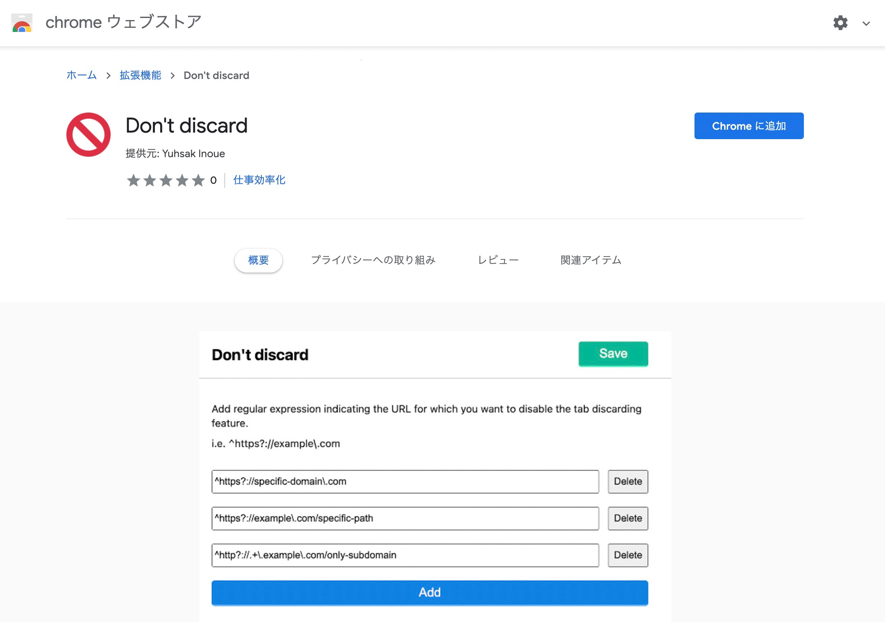

最近のGoogle Chromeは`automatic tab discarding`と言って非アクティブなタブのメモリを自動で解放する機能が有効になってるっぽい。

と言っても主にシステムメモリが足りてない時に発動するみたいだから基本は便利な仕様だと思うんだけど、なるべく解放しないで欲しいサイトもあるよね。

具体的にはコラボでセッションを開いている時とか。

コラボでセッション起動する→別のサイト見ながらローカルで割と重めの処理する→コラボのタブのメモリが解放される

↑こういうふうになっちゃうのが地味に不便。メモリ解放されるとセッション切断されたりするしリロード時にtqdmの表示が変なふうになったりするし…

探してみたらメモリ解放を無効にする系の拡張機能は何個かあったんだけど、正規表現で指定したURLだけ自動で無効にしてくれるやつがあったら一番便利だなーと思って作ってみた。

## インストール

[Don't discard - Chrome Web Store](https://chrome.google.com/webstore/detail/dont-discard/onodhifphgifinclhihikocgokedljbp)

デフォルトでは全てのURLが対象。設定画面で任意の正規表現を入力しておくと該当するURLのタブのみ自動サスペンドが無効になる仕組み。

<WarnBox>

条件を反映するためにはタブをリロードする必要があるから注意しよう。

</WarnBox>

## GitHubリポジトリ

リポジトリは[ここ](https://github.com/yuhsak/dont-discard)。

[yuhsak/dont-discard](https://github.com/yuhsak/dont-discard)

ちょっとした実装の解説についてZennにも[記事](https://zenn.dev/yuhsak/articles/64c3e207a98b73)を投稿したから興味があったらチェックしてみてね。

[Chromeでタブの自動サスペンドを無効化する](https://zenn.dev/yuhsak/articles/64c3e207a98b73)

