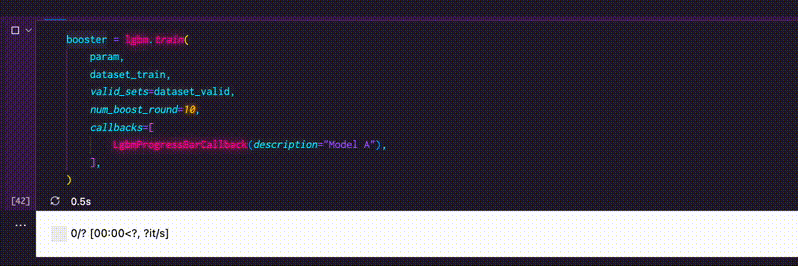

学習の進捗がずらずらっと標準出力に出てきちゃうの邪魔だよね。特にNotebook環境の時はすごい見にくくなるし。

今日はPythonライブラリの[`tqdm`](https://github.com/tqdm/tqdm)を使っていい感じのプログレスバーで進捗を表示するスニペットを紹介するよ。

<video autoplay loop muted playsinline>
    <source src="./lgbm-tqdm.webm" type='video/webm' />
    <source src="./lgbm-tqdm.mp4" type='video/mp4' />
    
</video>

1イテレーションにかかる時間もサクっと確認できて便利！

<InfoBox title='LightGBMのバージョン'>

`3.3.2`

</InfoBox>

## スニペット

`tqdm`を初めて使う時はpipやcondaでインストールしておこう。

```shell
pip install tqdm
```

LightGBMの`train`には関数を指定することでイテレーション毎に任意の処理を実行出来る`callbacks`オプションがある。

そこにtqdmで作ったプログレスバーを更新する処理を挟んで実現する仕組み。

```python
# str | Noneって書きたいところだけど3.7系でもいけるようにOptionalを使う
from typing import Optional
from collections import OrderedDict
from lightgbm.callback import CallbackEnv
from tqdm.auto import tqdm

class LgbmProgressBarCallback:
    description: Optional[str]
    pbar: tqdm

    def __init__(self, description: Optional[str] = None):
        self.description = description
        self.pbar = tqdm()

    def __call__(self, env: CallbackEnv):

        # 初回だけProgressBarを初期化する
        is_first_iteration: bool = env.iteration == env.begin_iteration

        if is_first_iteration:
            total: int = env.end_iteration - env.begin_iteration
            self.pbar.reset(total=total)
            self.pbar.set_description(self.description, refresh=False)

        # valid_setsの評価結果を更新
        if len(env.evaluation_result_list) > 0:
            # OrderedDictにしないと表示順がバラバラになって若干見にくい
            postfix = OrderedDict(
                [
                    (f"{entry[0]}:{entry[1]}", str(entry[2]))
                    for entry in env.evaluation_result_list
                ]
            )
            self.pbar.set_postfix(ordered_dict=postfix, refresh=False)

        # 進捗を1進める
        self.pbar.update(1)
        self.pbar.refresh()
```

使う時はこう。

```python
booster = lgbm.train(
    {**param, "verbosity": -1},
    dataset_train,
    valid_sets=dataset_valid,
    num_boost_round=10,
    callbacks=[
      LgbmProgressBarCallback(description="Model A"),
    ],
)
```

これでイテレーションごとにプログレスバーの進捗が更新されるようになるよ。

<InfoBox title="verbosity">

進捗以外のお知らせは普通に出力されちゃうから出来るだけ減らしたい場合は併せて`"verbosity": -1`を指定しておくといいかも。

`Info`系の出力が無くなって`Warn` `Error`系だけになるよ。

</InfoBox>

あと冒頭の`from tqdm.auto import tqdm`っていう部分、tqdmはこうやって書くとNotebook環境を自動で検知してリッチなウィジェットを表示してくれるんだけどVSCodeのNotebookだとうまくいかなかった。

[該当部分のソースコード](https://github.com/tqdm/tqdm/blob/7cdbfee224f94c8bc63dceaab42637962f2f2a04/tqdm/autonotebook.py#L17)を読んでみるとVSCodeはサポート外ということでわざとauto時のウィジェット表示をしないようにしてるみたい。

`from tqdm.notebook import tqdm`ってやれば普通にウィジェット表示にできるからVSCodeの人は試してみてね。

## CallbackEnvの中身

callbacksに渡した関数には`CallbackEnv`っていう形式のオブジェクトが引数として与えられる。

ここには学習中のBoosterインスタンスなんかも含まれるから今回みたいな進捗の表示以外にも色々なことが出来るよ。

バージョン`3.3.2`の時点の`CallbackEnv`の中身はこんな感じ。

| プロパティ             |      値 |                           説明 |
| :--------------------- | ------: | -----------------------------: |
| iteration              |     int |         現在のiterationのindex |
| begin_iteration        |     int | 学習を開始したiterationのindex |
| end_iteration          |     int |                  総iteration数 |
| model                  | Booster |            Boosterインスタンス |
| params                 |    Dict |                 学習パラメータ |
| evaluation_result_list |    List |     valid_setsに対する評価結果 |

modelとparamsも参照できるから特定のタイミングで`model`を保存したり`params`に変更を加えて学習時の振る舞いをカスタムしたりも出来るね。

<WarnBox>

`iteration`と`begin_iteration`がindexなのに対して`end_iteration`はlengthなことに注意。

例えば`num_boost_round = 10`の時にはbegin_iterationは0, iterationは0~9, end_iterationは10になる。

begin_iterationが0じゃないケースは既存のBoosterで学習を再開した時とかだと思う。

</WarnBox>

`evaluation_result_list`には`(valid_name, metric, value, is_higher_better)`形式のTupleが複数格納されている感じ。

```python
# evaluation_result_listの例
[
  ("valid_0", "binary_logloss", 0.034567, False),
  ("valid_0", "auc", 0.77, True),
  ("valid_1", "binary_logloss", 0.023456,  False),
  ("valid_1", "auc", 0.83, True),
]
```

`lightgbm.callback`モジュールの中にも公式で提供されているコールバック関数が何個か入ってて、実装はすごくシンプルで分かりやすいから興味があったら参考にしてみるといいかも。

[https://github.com/microsoft/LightGBM/blob/master/python-package/lightgbm/callback.py](https://github.com/microsoft/LightGBM/blob/master/python-package/lightgbm/callback.py)

- `log_evaluation`
  - valid_setsに対する評価結果をロガーに出力する
  - 学習パラメータの`verbose_eval`は廃止になるからこっち使ってねってことみたい
- `record_evaluation`
  - 指定したDictにevaluation_result_listの内容を転記する
- `reset_parameter`
  - 初回iteration終了時に指定したパラメータを上書きする。iterationを引数にとる関数を渡せるから進捗に応じた `learning_rate` の調整に利用するような想定なのかも
- `early_stopping`
  - 指定したiteration回数以上valid_setsに対するmetricが向上しなかったら学習を打ち切る
  - こちらも学習パラメータの`early_stopping_round`よりこっち使ってねって感じっぽい

みんな自分だけのコールバックを作ろう！

自分はどうにかして `learning_rate` をうまく調整して学習時間を短縮しつつ精度もギリギリまで確保するようなコールバックを作ろうとしてるんだけど全然うまくいってない😇

いい感じのが出来たら教えてね〜🙋‍♂️
