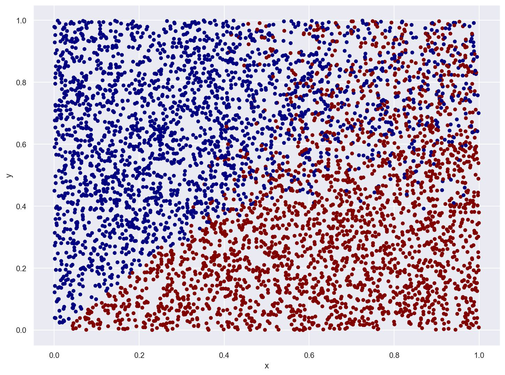
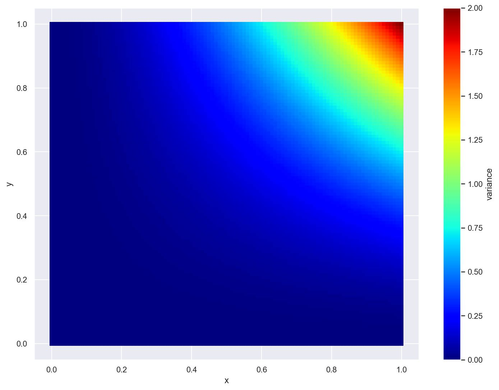
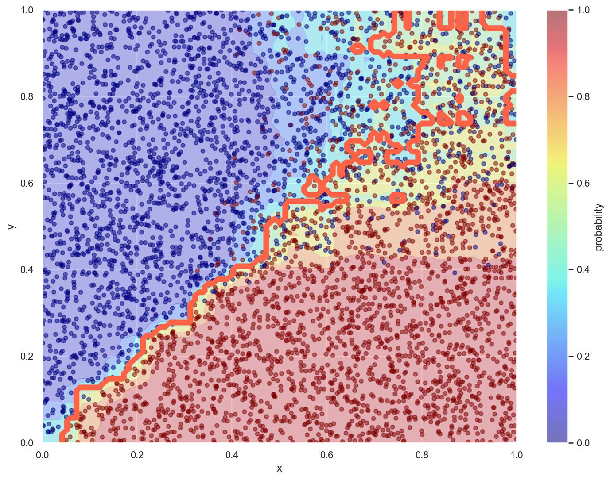
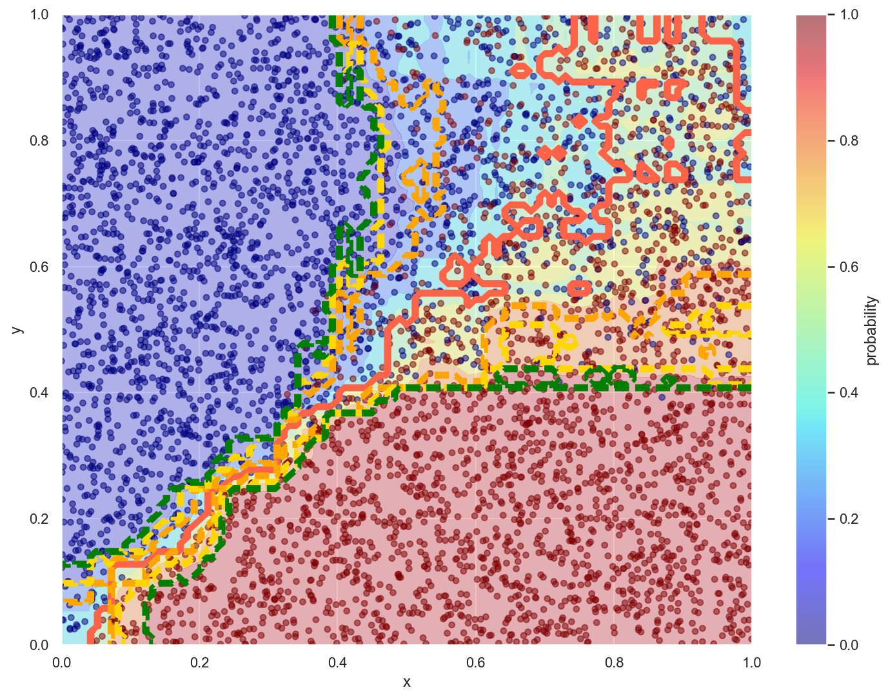
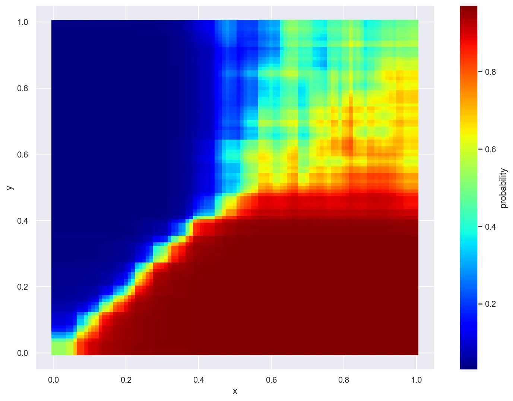
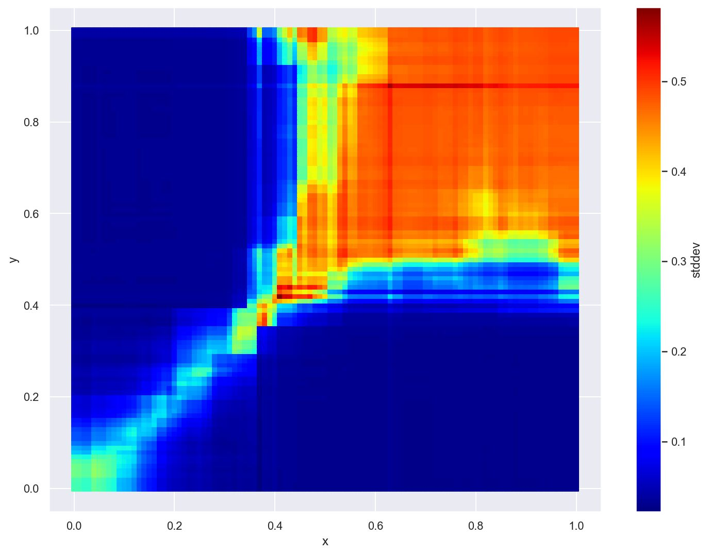

[前回の記事](./ngboost-with-lightgbm)では回帰モデルに対して予測区間を推定したけど、今度は2クラス分類で同じことを試してみる。

単変量だった前回と違って今回はx, yの2変数に対して与えられた0,1のラベルを予測していくよ。

## データの準備

データ数はちょっと増やして5000個にする。

```python
n_samples = 5000
x = np.random.uniform(0, 1, n_samples)
y = np.random.uniform(0, 1, n_samples)
```

ラベルは$y = x$のラインでの分割を基本として、グラフの右上に行くほど誤差の分散が大きくなるようにしてみた。

```python
def noise(x, y):
    return (x * y) ** 2.0 * 2.0

def obj(x, y):
    return np.where(y + np.random.normal(loc=0, scale=noise(x, y), size=x.shape[0]) < x, 1, 0)
```

```python
labels = obj(x, y)
```

境界が入り乱れている範囲の輪郭がラッパみたいな形になるね。



分散の大きさをプロットしてみるとこんな感じ。



## 分類モデルの学習

前回と同じくまずはベースのモデルを学習するよ。

`objective`以外のパラメータは前回と同じ。

```python
params = {
    "objective": "binary",
    "learning_rate": 0.01,
    "bagging_fraction": 0.5,
    "bagging_freq": 1,
    "lambda_l1": 1.0,
    "lambda_l2": 1.0,
}
```

```python
booster = lgbm.train(
    params,
    lgbm.Dataset(np.array([x, y]).T, labels),
    num_boost_round=300,
)

pred = booster.predict(np.array([x, y]).T)
```

モデルの予測確率と`閾値=0.5`とした時の決定境界をプロットしてみる。



思った通り右上に行くほど予測確率が曖昧でごちゃごちゃした感じの決定境界になってるね。

## 区間推定モデルの学習

続いてベースモデルの予測確率を元に出力値の分散を学習するモデルを作っていく。

目的関数は前回と一緒。

```python
def norm_likelihood_obj(log_var: np.ndarray, data: lgbm.Dataset):
    y_true = data.get_label()
    grad = 1 - (y_true - pred) ** 2 / np.exp(log_var)
    hess = (y_true - pred) ** 2 * np.exp(-1 * log_var)
    return grad, hess
```

学習部分も前回とほぼ一緒だね。

```python
booster_var = lgbm.train(
    params,
    lgbm.Dataset(np.array([x, y]).T, labels),
    num_boost_round=300,
    fobj=norm_likelihood_obj,
)
```

モデルが予測した分散から標準偏差を求めて、予測確率に対して標準偏差+-1,2,3個分それぞれの決定境界をプロットしてみる。

ちょっとごちゃっとして見にくいけどオレンジが`標準偏差×1`, 黄色が`標準偏差×2`, 緑が`標準偏差×3`の境界線だよ。



予測確率の色分けをなぞるような形の決定境界になってる！

回帰と違って分類は元々予測確率という形でモデルの自信度が表現されているから、あらためて分散を学習しても結局同じような意味になるということかな？

## 予測確率と標準偏差

実際にモデルの予測確率と予測分散をプロットしてみてもほぼ同じような形になっていることが分かる。

確率が曖昧なところほど分散が大きくなる感じ。





## まとめ

[前回の記事](./ngboost-with-lightgbm)で回帰モデルに対して予測区間を推定した手法が単純な2クラス分類にも適用できそうなことが分かった。

モデルの予測確率から簡単に自信度が推測出来てしまう今回のような例だと単純すぎてあまり意味が無いかもしれないけど、予測確率の扱い方に工夫が必要になってくるような複雑なデータでは有用かも？

引き続き運用してみて何か気づいたことがあればまた記事にするね。
