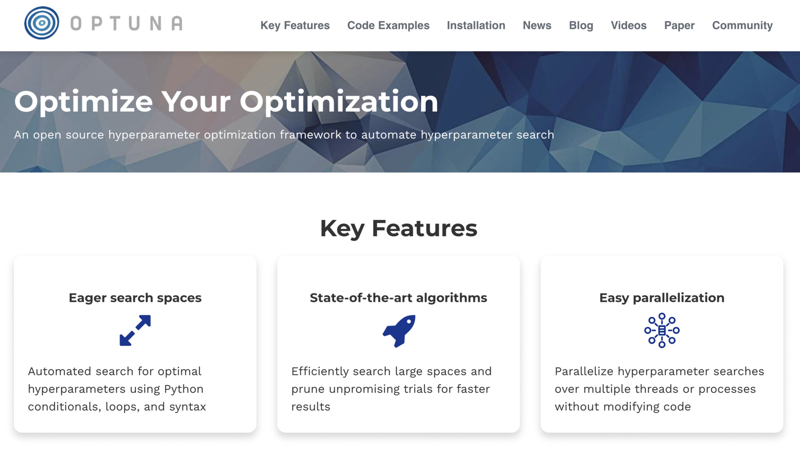
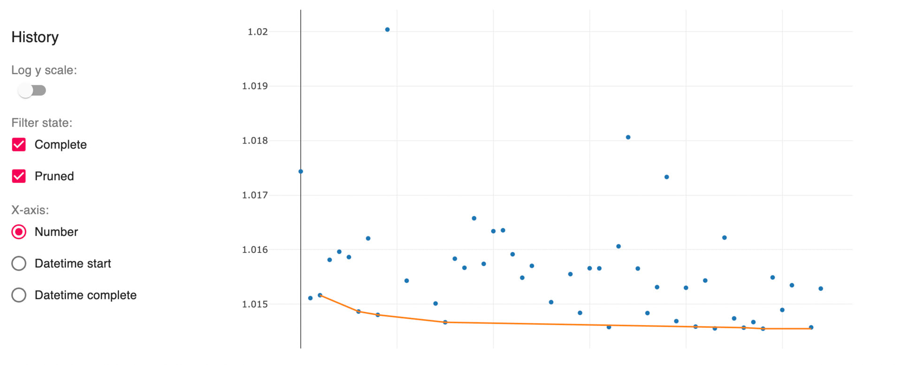
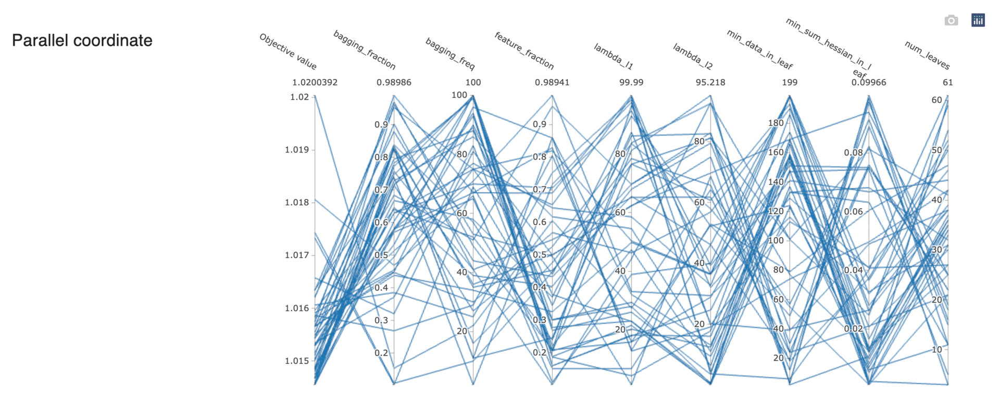
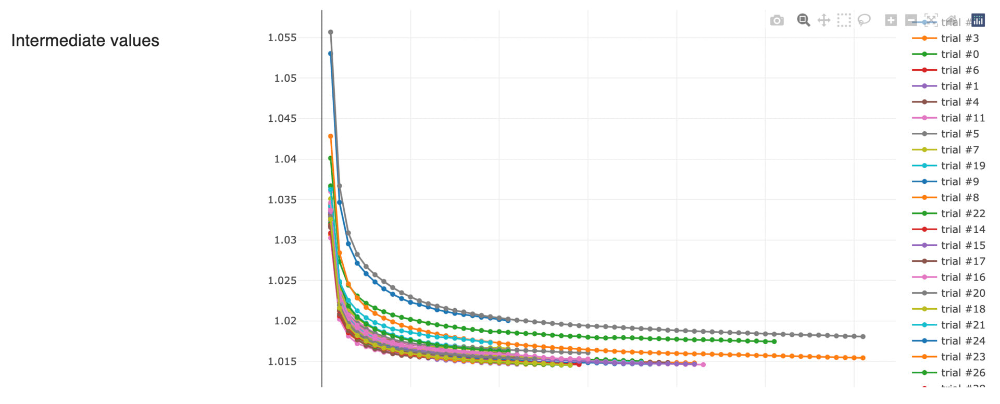
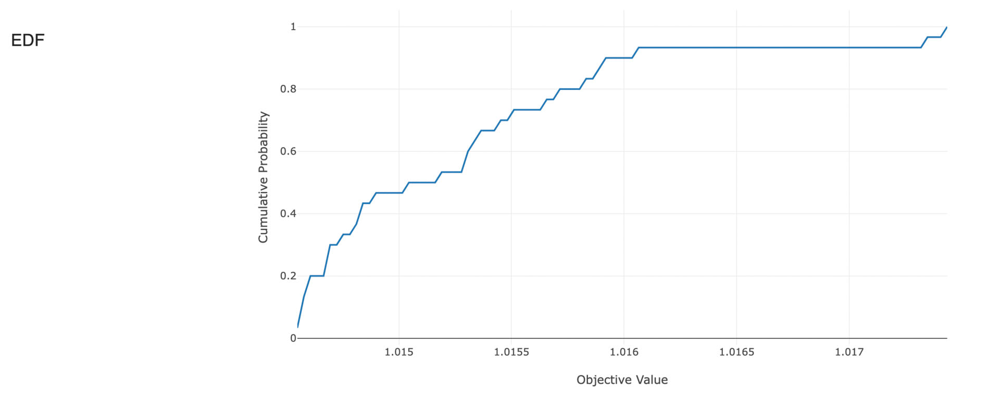
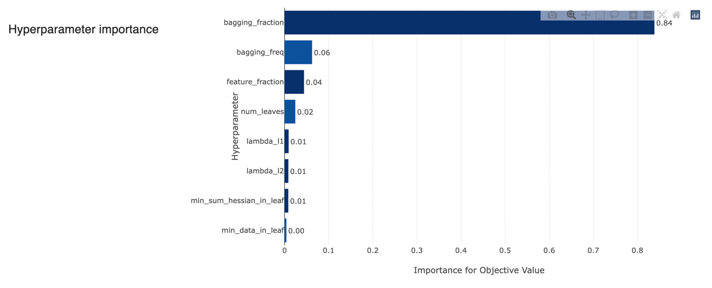
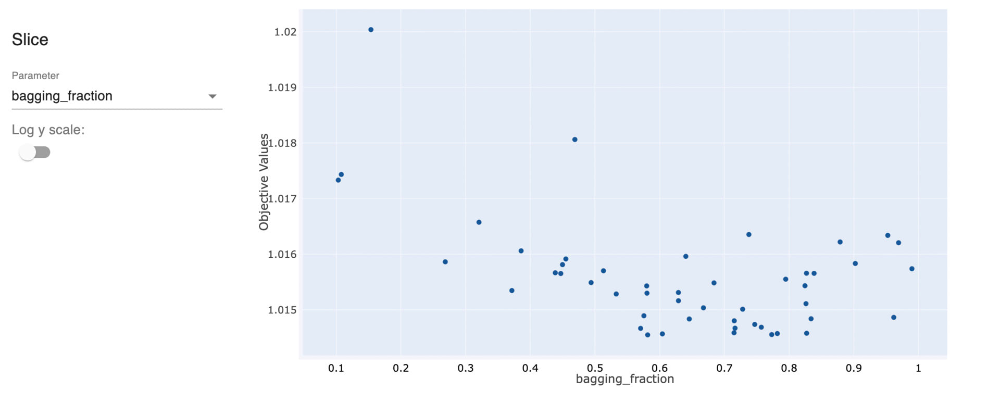
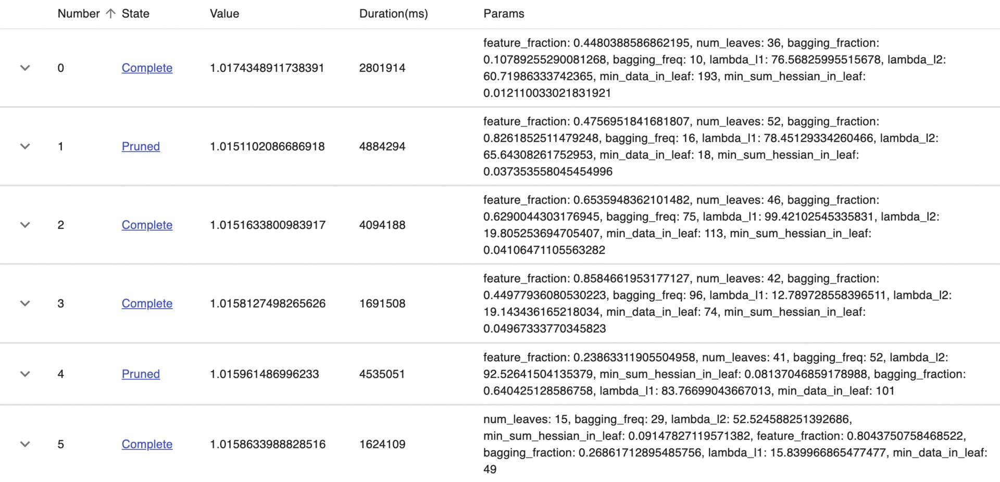

意外と難易度が高いモデルのハイパーパラメータチューニング。

チューニングするべきパラメータとその範囲についてよく考える必要があるし、実行時間もたくさん必要だから気軽にトライ&エラーを繰り返すのも難しい。

どちらかというと面白くないステップの作業だし面倒くさいって思いがちだよね。社内のチューニング職人的なすごい人に任せっきりだったり。

実際、頑張っても数%の精度向上にしかならないことも多いからコスパが悪い気がしちゃうけど分類性能が0.1%向上するだけで世界が変わってくるような状況だと向き合わざるをえなくなってくる。

月間数億円の予算に対してモデルの性能分のコストがダイレクトに削減できる場合とか、Kaggleなどのコンペで団子状態の時とか。

そんな時の強い味方！大好きなハイパーパラメータチューニングフレームワークの[`Optuna`](https://optuna.org)を紹介するよ。

ハイパラに限らず色々応用できる最適化フレームワークだから使いこなせるようになるとめっちゃ便利！

## Optunaの概要

[Optuna](https://optuna.org)

[](https://optuna.org)

Optunaは[株式会社Preferred Networks](https://www.preferred.jp)が2017年に発表してくれたハイパーパラメータチューニング用のフレームワークで、主にベイズ最適化の一種のTPE (Tree-structured Parzen Estimator)と呼ばれるアルゴリズムを使って最適な値の探索を行なってくれるというもの。

パラメータを色々変えながらモデルを学習させてみて「あるパラメータがある値の時スコアはこうだった」っていうのを逐一観測しながらスコアが良くなりそうな値を効率良く探してくれるといったもので、言わば賢いランダムサーチみたいな感じ。

ここで「効率良く」と言っても結局ランダムサーチと違うの？って思うかもしれない。

これはOptunaに限らず全てのパラメータサーチに言えることなんだけど、**探索に使える時間が膨大にあるという前提においては結局ランダムサーチを上回る手法は存在しない**ということが証明されてるんだよね。

パラメータの取りうる範囲全ての組み合わせについて総当たりで結果を確認すれば必然的にその中に最適値がある、と考えればイメージしやすい？良く考えてみればすごく当たり前なことだよね。

ただ実際には現実的に探索に使える時間は限られてるわけで。

そこで、限られた時間(リソース)の中でどれだけ効率良く最適解に近づくかっていうのがチューニングフレームワークの主な役割になってくる。

Optunaも前提としてランダムサーチより良い結果を保証するものってわけではなくて、**単位時間あたりの到達点をより最適解に近づけるための確率的な手法**を提供してくれるものだと思っておこう。

探索に使える時間に制限がある中で出来るだけ良い値を見つけたい時に特に重宝する、って感じかな。た、多分ね。

<InfoBox>

TPE含む最適化アルゴリズムとその比較についてはこの論文に色々載ってるから興味ある人はチェックしてみてね。

[Algorithms for Hyper-Parameter Optimization](https://proceedings.neurips.cc/paper/2011/file/86e8f7ab32cfd12577bc2619bc635690-Paper.pdf)

</InfoBox>

## 基本の使い方

使い方を順を追って紹介していくよ。インストールはこう。

```shell
pip install optuna
```

この記事を書いてるタイミングの最新版は`2.10.0`。(もしかしたらアップデートで記事の内容が古くなってるかもしれないことに注意してね)

まずは一番簡単な例として「二乗した値が一番小さくなる時の変数xの値」を`-10 ~ 10`の範囲で探索するコードから。

```python
import optuna

def objective(trial: optuna.Trial):
    x = trial.suggest_uniform("x", -10.0, 10.0)
    return x ** 2

study = optuna.create_study()

study.optimize(objective, n_trials=100)
```

```python
## 一番良かった値
study.best_value
# => 0.00000001

## その時のパラメータ
study.best_params
# => {"x": 0.0001}
```

まずパラメータを最適化したい関数を`objective`として用意する。

その関数を`Study`インスタンスの`optimize`メソッドに与えることで`n_trials`で指定した回数だけパラメータを探索しながら試行してくれて、`best_params`と`best_value`にそれぞれ結果が格納される。

パラメータはデフォルトだと関数の出力値が最小化される方向に最適化されるよ。最大化したい時は`create_study()`時に`direction="maximize"`を指定すればOK。

この例だと最小値は0だからなるべく0に近い出力が得られるxの値を探してくれる。

なんとなくわかると思うけど、パラメータの名前と範囲は`objective`に渡されてくる`Trialインスタンス`の`suggest_*系メソッド`を使って指定する仕組み。

めっちゃ簡単だね！

例ではxが0の時に解が最小となるのが自明すぎて感動薄いけど、ここにモデルを学習するコードを入れて`RMSE`や`LogLoss`なんかの評価関数の出力値をreturnするようにすればそのままハイパーパラメータの探索になるってわけ。

↓参考までにLightGBMのチューニング例。なんとなく雰囲気わかる？

```python
def objective(trial: optuna.Trial):

    # bagging_fractionの最適値を0.1~1.0の範囲で探索
    bagging_fraction = trial.suggest_uniform("bagging_fraction", 0.1, 1.0)

    # bagging_freqの最適値を1~100の範囲で探索
    bagging_freq = trial.suggest_int("bagging_freq", 1, 100)

    # feature_fractionの最適値を0.1~1.0の範囲で探索
    feature_fraction = trial.suggest_uniform("feature_fraction", 0.1, 1.0)

    params = {
        **base_params,
        "verbosity": -1,
        "bagging_fraction": bagging_fraction,
        "bagging_freq": bagging_freq,
        "feature_fraction": feature_fraction,
    }

    dataset_train = lgbm.Dataset(df_train[x_cols], df_train[y_col])
    dataset_valid = lgbm.Dataset(df_valid[x_cols], df_valid[y_col], reference=dataset_train)

    booster = lgbm.train(
      params,
      dataset_train,
      valid_sets=dataset_valid,
      num_boost_round=1000,
      callbacks=[lgbm.early_stopping(100, verbose=False),],
    )

    return booster.best_score["valid_0"]["binary_logloss"]

study = optuna.create_study()

study.optimize(objective, n_trials=100)
```

```python
study.best_score
# => 0.0031234

study.best_params
# => {
#     "bagging_fraction": 0.7890123,
#     "bagging_freq": 10,
#     "feature_fraction": 0.6789012,
# }
```

雑すぎるって怒られそうで言うのが怖いんだけど、本当に関数とパラメータだけ用意すれば最適化できちゃうから良い感じの組み合わせを求めたい時は何でもえいっとOptunaに任せるだけですごくそれっぽい答えを出してくれたりする。

`Nelder-Mead`や`Powell`レベルの便利さ。最高だね。

**ある関数が最小となるパラメータの値を求めたい & ちゃんと計算して綺麗に求める方法がありそうな気はするけど頭が悪すぎて全然わからない**時ってない？自分は~~いつもそう~~割とある。

## 使えるsuggest系メソッド

探索するパラメータの範囲を指定するために用意されてるsuggest系メソッドの一覧は`2.10.0`の時点だとこんな感じ。

パラメータの種類によって使い分けよう。`range`関数と同じでlowの値は含まれるけどhighの値は含まれないことに注意。

### [suggest_uniform(name, low, high)](https://optuna.readthedocs.io/en/stable/reference/generated/optuna.trial.Trial.html#optuna.trial.Trial.suggest_uniform)

- float型
- 線形空間からサンプリング

### [suggest_loguniform(name, low, high)](https://optuna.readthedocs.io/en/stable/reference/generated/optuna.trial.Trial.html#optuna.trial.Trial.suggest_loguniform)

- float型
- 対数空間からサンプリング
  - 小さい値の範囲ほど密に探索されて大きいところはその逆になる
  - 例えば1\~10の範囲では1,2,3,4,5,6,7,8,9って細かく試してみて欲しいけど100\~200では100, 140, 180とかざっくり試すだけで良いみたいなパラメータに使う

### [suggest_discrete_uniform(name, low, high, step)](https://optuna.readthedocs.io/en/stable/reference/generated/optuna.trial.Trial.html#optuna.trial.Trial.suggest_discrete_uniform)

- float型
- `step`で指定した間隔に従ったサンプリング

<WarnBox>

`step`が指定されている時はサンプル範囲に`high`の値が含まれることに注意しよう。

例) `low = 1.0` `high = 1.5` `step = 0.1`の時のサンプル候補は`1.0` `1.1` `1.2` `1.3` `1.4` `1.5`

</WarnBox>

### [suggest_float(name, low, high, step = None, log = False)](https://optuna.readthedocs.io/en/stable/reference/generated/optuna.trial.Trial.html#optuna.trial.Trial.suggest_float)

- float型
- `suggest_uniform` `suggest_loguniform` `suggest_discrete_uniform` のラッパー
  - `log = True` の時は`suggest_loguniform`
  - `step`が指定されている時は`suggest_discrete_uniform`
  - どちらも指定されていない時は`suggest_uniform`
  - `step`と`log`を同時に指定することは出来ない

### [suggest_int(name, low, high, step = 1, log = False)](https://optuna.readthedocs.io/en/stable/reference/generated/optuna.trial.Trial.html#optuna.trial.Trial.suggest_int)

- int型
- 線型空間からサンプリング
- `step` `log`の動作は`suggest_float`と同じ

### [suggest_categorical(name, choices)](https://optuna.readthedocs.io/en/stable/reference/generated/optuna.trial.Trial.html#optuna.trial.Trial.suggest_categorical)

- 任意のリスト`choices`の要素から1つ選択 (boolやstrなど数値以外でも可)
  - 例) `boosting = trial.suggest_categorical("boosting", ["gbdt", "goss", "dart", "rf"])`

## 探索状況の保存と再開

Optunaではあるパラメータ(たち)の一連の最適化を1まとめにした単位を`Study`、その中の1回の試行を`Trial`っていうんだけど、このStudyには最適化の探索状況を保存しておいて共有したり後から再開したりする機能がある。

特に指定しないと最適化の状況はメモリ内に保持されるから毎回実行する度にまっさらな状態から探索が始まるよね。例に示したコードもそう。

[`create_study`](https://optuna.readthedocs.io/en/stable/reference/generated/optuna.study.create_study.html)する時の`storage`オプションにDBのuriを指定するとそのDBに最適化の状況が保存されるようになるよ。

ローカルで使うだけなら`SQLite`を指定すれば何も準備しなくてOKだし、リモートサーバ上の`MySQL`や`PostgreSQL`なんかに接続すれば複数のマシンで進捗を共有しながら並列に最適化を走らせることも出来る。

<NoteBox title="SQLite">

`SQLite`というのは単一のバイナリをストレージの基本単位として扱う便利なスタンドアロン型のRDBなんだけど、初見の人は今回は「ノー準備で使えるローカル専用の便利なDB」ぐらいに思っておいてOKだと思う。

</NoteBox>

SQLiteインターフェースはPythonにデフォルトで備わっててすぐに使えるし、過去の探索を後から見返したり再開したりできると結構便利だからローカルだけで使う場合も最低限SQLiteを使った永続化はしておくようにしよう。

後述するダッシュボードを使った状況の可視化もできるようになるしね。

```python
study = optuna.create_study(
    storage="sqlite:///optuna.sqlite3",
    study_name="lgbm-params",
    load_if_exists=True,
)
```

これでカレントディレクトリに`optuna.sqlite3`というSQLite3形式のDBファイルが作成されて進行状況が保存されるようになる。

<WarnBox>

storageを指定する時はStudyを特定するための`study_name`も適宜設定する必要があることに注意しよう。

既にDBに同名のStudyが存在する場合の読み込みと再開を許可するオプションの`load_if_exists`を`True`にするのも忘れないように。

</WarnBox>

この状態で`optimize()`を実行すると実行するたびに100回, 200回, 300回と前回の続きから最適化が行われるようになるよ。

```python
# 一度終了しても関係なく引き続き最適化が走る
study.optimize(objective, n_trials=100)
```

ちなみに**コラボ環境で複数のNotebookからマウントしたGoogle Drive上のSQLiteファイルを指定すればDBサーバ要らずの並列最適化が出来る**気がしてしまうけど、これやると上手くいかないどころか**SQLiteファイル自体ぶっ壊れる**ことがあるからマジで注意してね。

これはコラボとかGoogle Driveが問題なんじゃなくてSQLiteが実現してるファイル単位の整合性担保がOSのファイルシステムのロック機構に依存した仕組みになってることが理由みたい。

SQLiteの公式サイトにも「ネットワーク経由で動作するファイルシステムはロック周りの挙動が絶対何かしらバグってるからSQLiteうまく動かないよ」って[書いてあった。](https://www.sqlite.org/faq.html)

> SQLite uses reader/writer locks to control access to the database. (Under Win95/98/ME which lacks support for reader/writer locks, a probabilistic simulation is used instead.) But use caution: this locking mechanism might not work correctly if the database file is kept on an NFS filesystem. This is because fcntl() file locking is broken on many NFS implementations. You should avoid putting SQLite database files on NFS if multiple processes might try to access the file at the same time.

「Windows 95, 98, MEにはファイルのロック機構が無いから確率的にシミュレートして代用してるよ」とも書いてあるけど、どゆこと?? そんなことできる??

複数マシンで並列化したい時は素直にどこかにDBサーバを用意しよう。

## Prunerで早期に枝刈り

例えばモデルの学習だと割と早期に「あ、このパラメータ全然ダメっぽいな」って判断できることあるよね。

初期に損失が減少するペースが遅すぎて収束まで待っても確実に微妙な精度にしかならなそうな時とか。

Optunaにも探索をより効率化するためにダメそうな試行を早期に打ち切って次に進むPrune(枝刈り)という機能があって、`Pruner`という仕組みを使って簡単に実現することが出来る。

<InfoBox title="代表的なPruner">

あるエポックやイテレーションの時点で過去の試行の中央値に届いていなければ打ち切る`MedianPruner`が代表例。他にも色々なルールのPrunerが用意されてるよ。

</InfoBox>

個人的にはこのPrunerの使いやすさもOptunaの一押し便利ポイント！ダメそうな組み合わせをどんどん飛ばして良さげなものに注力できるって素晴らしいよね。

と言っても途中で打ち切りをするってことは当然最初はダメでもその後挽回して良いスコアに達していたはずの試行まで捨ててしまうことになる。

早期に打ち切れば打ち切るほどそのリスクは増えるし、逆に打ち切り判定を遅らせれば遅らせるほど今度は無駄な時間を使ってしまうリスクが増える。

そもそも扱ってるモデルは後から挽回する可能性がほぼ無いような学習曲線のものなのか、それがワンチャン全然ありえるモデルなのか。

リスクをどう考慮するかはそういったモデルの学習の性質にもよるんだけど、Optunaにはこの部分のバランスに着目したPrunerなんかもあるから紹介したいと思う。

### Prunerの基本

まずは超基本の使い方から。

これもstorageの時と同じく`create_study()`の`pruner`オプションに指定する形で使うよ。

`MedianPruner`のコード例はこんな感じ。

```python
study = optuna.create_study(
    pruner=optuna.pruners.MedianPruner(),
)
```

Studyを作る時はこれだけでOKなんだけど、学習の進捗に応じて打ち切りを決定するっていうPrunerの性質上どうしても学習の進捗をOptunaに知らせる必要があるのね。

だからモデル学習時のコールバックにもPruningを制御する簡単なコードを挟む必要があるよ。

LightGBMの例だとこんな感じ。[^1]

LightGBMのコールバックの書き方については[LightGBMの進捗をプログレスバーで表示する](./lightgbm-with-progress-bar)にもまとめてあるから興味があれば是非見てみてね。

```python
from typing import Optional
from lightgbm.callback import CallbackEnv
import optuna

class LgbmPruningCallback:
    trial: optuna.Trial
    interval: int

    def __init__(self, trial: optuna.Trial, interval: Optional[int] = 10):
        self.trial = trial
        self.interval = interval

    def __call__(self, env: CallbackEnv):

        # {interval}回ごとに判定
        if (env.iteration + 1) % self.interval > 0:
            return

        # validation結果が無い場合はスキップ、あれば先頭のものを使う
        if len(env.evaluation_result_list) == 0:
            return
        entry = env.evaluation_result_list[0]

        # Optunaにstepとスコアを報告
        self.trial.report(entry[2], step=env.iteration)

        # Prunerのルールに引っかかってたら打ち切り
        if self.trial.should_prune():
            raise optuna.TrialPruned(f"Trial was pruned at iteration {env.iteration}")
```

大事なのは`trial.report(value, step)`を実行してiterationとその時のスコアをOptunaに報告するってところと、`trial.should_prune()`で打ち切りの判定を取得するところ。

<InfoBox title='ステップ'>

引数名からも分かるようにOptunaではエポックやイテレーションなどの学習の反復の単位を総称してステップと呼ぶようになってるよ。覚えておこう。

</InfoBox>

学習のcallbacksに指定する時は`objective`の引数のtrialをこのコールバックにも渡してあげるようにする。

```python
def objective(trial: optuna.Trial):

    ## ~~省略~~

    booster = lgbm.train(
        params,
        dataset_train,
        valid_sets=dataset_valid,
        num_boost_round=1000,
        callbacks=[
            lgbm.early_stopping(100),
            # trialを引数にしてcallbacksに差し込む
            LgbmPruningCallback(trial),
        ],
    )

    return booster.best_score["valid_0"]["binary_logloss"]

study = optuna.create_study(
    pruner=optuna.pruners.MedianPruner(),
)

study.optimize(objective, n_trials=100)
```

この例だと`MedianPruner` × 10イテレーションごとの打ち切り判定になっているから「10回ごとにスコアを確認して、過去の試行におけるそのiteration時点でのスコアの中央値に届いていない場合に学習が打ち切られる」という設定になるよ。

<NoteBox>

わざわざ10イテレーションごとにしてるのは毎回Optunaにスコアの報告と打ち切りの確認をしてるとそれに時間を取られて学習が遅くなるから。

特にリモートサーバのDBに接続してる場合は必須の工夫だと思うから覚えておくといいかも。

</NoteBox>

何となく流れがわかったよね？

こんなふうにどんなモデルでもコールバックに同様の処理を仕込むことが出来ればPrunerと組み合わせることが出来る。

逆にコールバックが指定できないライブラリは悲しいことに諦めるしかないんだけど、最近のライブラリは割と何でもコールバックを差し込めるから活用できるケースは多そうだよね。

[^1]:
    仕組みの解説のためにコールバックの実装例を載せたけど、実はOptunaのLightGBM用integrationではほとんど同じ動作をする[`LightGBMPruningCallback`](https://optuna.readthedocs.io/en/stable/reference/generated/optuna.integration.LightGBMPruningCallback.html)っていうやつを用意してくれてるからそっちを使ってもOK。
    個人的にはこういう外部ライブラリ連携系のインターフェースってどうしてもメンテが後回しになりがちで最新版に追従できてないがちな印象があるから気に入ったやつは自分で書いちゃうスタイルが好み。

Prunerの基本的な使い方が分かったところでざっくり一覧を紹介するよ。

### [MedianPruner](https://optuna.readthedocs.io/en/stable/reference/generated/optuna.pruners.MedianPruner.html)

スコアが過去のTrialにおけるステップtでの中央値に達していないものを打ち切りするわかりやすいPruner。

オプションでTrial数やステップ数に応じた打ち切り条件を指定できるよ。

**指定可能なオプション**

- `n_startup_trials`
  - とりあえずこの数字の数だけTrialが完了するまでは打ち切りが行われなくなる
  - デフォルト: 5
- `n_warmup_steps`
  - 個々のTrialについてこの数字以下のステップでは打ち切りを行わない
  - デフォルト: 0
- `interval_steps`
  - この数字の分だけ間隔を空けたステップごとにしか打ち切り判定が行われなくなる
  - 自作のコールバックで`report()`するタイミング自体を制御してると干渉するから注意しよう
  - デフォルト: 1
- `n_min_trials`
  - 各ステップにおいてそのステップに到達したTrialがこの数字に達するまでは打ち切りが行われなくなる
  - デフォルト: 1

### [PercentilePruner](https://optuna.readthedocs.io/en/stable/reference/generated/optuna.pruners.PercentilePruner.html)

MedianPrunerのパーセンタイルを指定できるバージョン。

打ち切り条件のTop N パーセンタイルを`0.0` ~ `100.0`の範囲で引数に指定する。多分50.0にするとMedianPrunerと同じことかな？

指定可能なオプションもMedianPrunerと同じ。

### [ThresholdPruner](https://optuna.readthedocs.io/en/stable/reference/generated/optuna.pruners.ThresholdPruner.html)

スコアに上限と下限を設けてはみ出た場合に打ち切りを行うPruner。

特定のパラメータの組み合わせの時だけ損失が発散し続けて学習が収束しない、といったようなケースを弾くために使う想定みたい。

`n_warmup_steps`と組み合わせれば単純にあるステップでのスコアが一定値に達していないものを一律で打ち切る使い方もできるね。

**指定可能なオプション**

- `lower`
  - スコアの下限値
  - デフォルト: None
- `upper`
  - スコアの上限値
  - デフォルト: None
- `n_warmup_steps`
  - 個々のTrialについてこの数字以下のステップでは打ち切りを行わない
  - デフォルト: 0
- `interval_steps`
  - この数字の分だけ間隔を空けたステップごとにしか打ち切り判定が行われなくなる
  - 自作のコールバックで`report()`するタイミング自体を制御してると干渉するから注意しよう
  - デフォルト: 1

### [SuccessiveHalvingPruner](https://optuna.readthedocs.io/en/stable/reference/generated/optuna.pruners.SuccessiveHalvingPruner.html)

Successive Halvingという、ハイパーパラメータの最適化を多腕バンディット問題の一種と捉えて計画するアルゴリズムを応用したPruner。

[Non-stochastic Best Arm Identification and Hyperparameter Optimization](https://arxiv.org/abs/1502.07943)

これは限られた時間や学習回数の中で出来るだけ良い結果になりそうなパラメータに多くのリソースを割くことに注目したアルゴリズムのよう。 [^2]

[^2]: 正確にはOptunaでは元のSuccessive Halvingじゃなくて並列実行に対応した[Asynchronous Successive Halving](http://arxiv.org/abs/1810.05934)が採用されてる&実装の都合により論文とは細部が若干異なるとのこと。

詳しくは論文を参照して欲しいんだけど、このアルゴリズムの最大のポイントは **`全体のリソース`と`生き残らせるTrial数`を増やせば増やすほど、最終的に得られるハイパーパラメータが最適なものに漸近的に近づいていく** ことが理論的に証明されているところ…で合ってるのかな？難しくて自信ないけど…。

仕組みが分かればもっと理解できるかもしれない。このPrunerの4つのパラメータ `min_resource` `reduction_factor` `min_early_stopping_rate` `bootstrap_count` を元に順番に仕組みを整理してみよう。

必須の引数は`min_resource`だけでその他はOptional。各パラメータのデフォルト値は`reduction_factor = 4` `min_early_stopping_rate = 0` `bootstrap_count = 0`になってるよ。

#### min_resource & reduction_factor

まずメインになるパラメータが`min_resource`と`reduction_factor`の2つ。

`min_resource`には個々のTrialに割り当て可能な最低リソースを指定する。これ自体は抽象的な数値だから回数でも時間でも多分何でも良いんだけど、基本Optunaでは各学習で確保したい最低イテレーション数とかエポック数を指定する想定みたい。[^3] これを仮に100としよう。

[^3]: もし単位を時間にしたい時は`trial.report()`で報告するステップ数を経過秒数とかにすればいけそう。

続いて、このPrunerはステージ0, ステージ1, ステージ2とステップ数に区切りを設けて段階的に打ち切り判定を行うようになっていて、そんでこの時のステージ番号を$\text{rung}$とする。この数字は0から始まって判定が行われる度に1、2、3と増えていく。

そうするとまず打ち切り判定は基本的に $\text{min\_resource} \times \text{reduction\_factor}^{\text{rung}}$ ステップ毎に行われる形になる。

仮に `min_resource = 100` `reduction_factor = 4` とした時、一回目の判定は $100 \times 4^0 = 100$ ステップ時に行われる。

二回目の判定は $100 \times 4^1 = 400$ ステップ時、同様に三回目は $100 \times 4^2 = 1600$ ステップ時。

そしてその時の打ち切り条件は過去のTrialのそのステップにおけるスコアのトップ $\large \frac{1}{\text{reduction\_factor}}$ 以内に入るかどうか、となる。

この場合は100, 400, 1600, 6400ステップ時にトップ$\large \frac 1 4$に入るかどうかで判定が行われる形になるね。

同様に`reduction_factor`が`2`の時を考えてみると100, 200, 400, 800ステップ時にトップ$\large \frac 1 2$の条件で判定が行われることになる。

`reduction_factor` の値が大きいほどじっくりステップを重ねてから判定するようなっていくんだけど、その分判定条件は厳しくなるという感じ。

試しに`reduction_factor`ごとに判定が行われるステップを計算してみるとこう。

| reduction_factor |   1 |   2 |     3 |      4 |      5 |
| :--------------- | --: | --: | ----: | -----: | -----: |
| 2                | 100 | 200 |   400 |    800 |  1,600 |
| 3                | 100 | 300 |   900 |  2,700 |  8,100 |
| 4                | 100 | 400 | 1,600 |  6,400 | 25,600 |
| 5                | 100 | 500 | 2,500 | 12,500 | 62,500 |

#### min_early_stopping_rate

上記の内容をベースに`min_early_stopping_rate`で判定が行われるタイミングを調整できる。指定すると判定ステップ数の計算が下記のように行われるようになる。

$$
\small
r = \text{reduction\_factor} \newline \ \newline
s = \text{min\_early\_stopping\_rate} \newline \ \newline
\text{step} = \text{min\_resource} \times r^{\text{rung}+s}
$$

数字を大きくすると判定が行われるステップを後回しにできるから判定条件はそのままに生き残るTrialの割合を増やす方向へ調整するために使える、っていうことかな？

特に`reduction_factor`が大きい時に最初の`min_resource`ステップ目でかなり厳しい判定が行われてしまうのを調整するためにある項目な気がする。

#### bootstrap_count

最後の`bootstrap_count`は各$\text{rung}$においてそのステップに到達したTrialの数が指定した値を上回るまでTrialが次の$\text{rung}$へ進むことを抑制するというもの。

例えば100, 400, 1600ステップ時に判定が行われるって場合にこれを`5`にしてると100ステップまで到達したTrialの数が5個未満のうちは全てのTrialが100ステップ目で打ち切られる。
5Trialになった時点で初めて次の400ステップの判定まで進む可能性のあるTrialが出てきて、、以下繰り返し。

各rungで生き残るTrialの条件が「少なくともbootstrap_count個のTrialの中のTop$\large \frac{1}{\text{reduction\_factor}}$」になるって感じかな。

条件がTop$\large \frac{1}{n}$だからnが十分確保できてない時は選別が安定しない気がするんだけど、そこにベースラインを設けるためにある？

#### まとめ

以上が現時点での自分の理解。特に`reduction_factor`が大事で、結局これが大きい値だと打ち切るTrialの割合が増えて小さい値だと多く生き残るようになるということだと思う。

やはり最適化に費やせる`全体のリソース`と`生き残らせるTrial数`にトレードオフがあるような感じ。意識しなければいけないのはここらへんかな。

- たくさん打ち切れば一定のリソース(時間)の中で試せるパラメータ数は増えるけど最適なものを逃すリスクが高まる
- たくさん生き残らせると最適なものを得られる可能性は高まるけど試行回数を確保するために多くのリソースが必要になる

調整の方針としてはこういう感じになってくるのかな。

- あんまり時間をかけずにサクっと済ませたい。結果がそれなりなら最適値じゃなくてもいい
  - → `reduction_factor`を`大きく`
- しっかり時間をかけて出来るだけ最適値に近づきたい
  - → `reduction_factor`を`小さく`

モデルの性質を考慮に入れるのはもちろん、最適化全体にどれだけ時間をかけられるかっていうところも考えながら調整してねってことだよね多分。

かけられる時間があんまり無いなら雑でも良いから試行回数を優先した方が良さそうだし、じっくり時間とれるならそもそも試行回数は心配せずに吟味する方向にした方が良さそうだし。

でもあんまり自信無い。間違ってたらマジでごめんね！

どうしてこうすると探索の効率が良くなるのかっていう理論的な部分は正直自分には全然分かってないんだけど、一見しただけでもリーズナブルなやり方に思える。

ただモデルの学習って到達する最大ステップ数が決まってるから、実際に到達し得るrungは`min_resource`と`最大ステップ数`の比率によって決まるってことだよね。

同じ`reduction_factor`を使ってても最大ステップ数に対しての`min_resource`の比率が小さければ小さいほど生き残る割合は少なくなるかわりに多くのTrialを試せるようになるから、実質この比率もトレードオフに大きな影響を与える重要な項目と言える。

実際に使う時はそこらへんも考慮に入れないと使いにくいと思うんだけどいちいちrungのステップ数を意識しながら使うのもちょっと大変だね。

### [HyperbandPruner](https://optuna.readthedocs.io/en/stable/reference/generated/optuna.pruners.HyperbandPruner.html)

個人的なPrunerの大本命がこれ！

[Hyperband: A Novel Bandit-Based Approach to Hyperparameter Optimization](https://www.jmlr.org/papers/volume18/16-558/16-558.pdf)

`min_early_stopping_rate`の値を変えた複数のSuccessiveHalvingPrunerを使って早期から打ち切っていくパターンと長く猶予を与えるパターンを組み合わせた動作を実現してくれるやつ。最強そう…！

Successive Halvingの時に問題だった`リソース`と`生き残らせる割合`のバランスついて様々な組み合わせを用意してトレードオフを出来るだけ緩和しようとしてる感じ。

特に`min_resource`だけじゃなくて`max_resource`も指定することで`reduction_factor`に応じていい感じになるように調整してくれるのがアツい。

実装の中身は実際に複数のSuccessiveHalvingPrunerを作って取り回すようになっているみたいで、パラメータは`min_resource` `max_resource` `reduction_factor` `bootstrap_count`の4つとなっている。こちらの`reduction_factor`のデフォルト値は`3`。

`min_resource`に確保したい最低限のステップ数、`max_resource`に個別のTrialに許容できる最大ステップ数を指定することで内部でSuccessiveHalvingPrunerを何個組み合わせるか決めてくれるみたい。

作成した子Prunerのうちどれか1つをそれぞれのTrialに割り当てて使う仕組み。

学習の開始時にガンガン切っていくパターンか長い目線パターンかが決まるっていうことだね。

注意点はこの`max_resource`はあくまでも大体こんなもんですよという数字をPrunerに教えるための参考値だから、例えステップ数がこの数字を超えたとしてもPruner自体がそれを基準に打ち切りをしたりはしないっていうこと。

そこは普段通りモデルの学習パラメータでハンドリングしないといけない。逆に言うとはみ出ても大丈夫。

<InfoBox>

`max_resource`を指定しない場合は実際に観測したステップ数の最大値から推測してくれるようになってる。

打ち切りにならない限り到達する最大ステップ数が一律で決まってる場合は省略してもいいんだけど、`EarlyStopping`を使ってたりしてTrialごとに到達する最大ステップ数にばらつきがある場合は明示的に指定するべしとのこと。

</InfoBox>

#### 作成されるPrunerの構成

内部で作成される子Prunerの数は以下の式で決まるらしい。

$$
\small
r = \text{reduction\_factor} \newline \ \newline
N = \text{floor}\bigg(\log_{r}\Big(\frac{\text{max\_resource}}{\text{min\_resource}}\Big)\bigg) + 1
$$

例えば `min_resource = 100` `max_resource = 1000` `reduction_factor = 3` の時は…

$$
\small
\begin{aligned}
N &= \text{floor}(\log_3 \frac{1000}{100}) + 1 \\
N &= \text{floor}(\doteqdot 2.096) + 1 \\
N &=  3
\end{aligned}
$$

ということで3つの子Prunerが作られるってことかな。`reduction_factor` を2に減らすと4つ作成されることになるね。

多分子Prunerが1個だけの時は単一のSuccessiveHalvingPrunerと同じになっちゃってあんまり意味がないと思うから適宜調整しよう。

各子Prunerに与えられる`min_early_stopping_rate`は単純にそのPrunerのインデックスになるよう。Pruner1は0.0, Pruner2は1.0, Pruner3は2.0, ...。

#### TrialにPrunerを割り当てる仕組み

子PrunerはTrialに対してそれぞれ均等に割り当てられるんじゃなくてある一定の重みに従うようになってる。

打ち切りが厳しいものほど多く、なるべく生き残らせるものほど少ない割合になるみたい。

まずそれぞれの子Prunerに対してある方法で求めたバジェットという数字が与えられるんだけど、結果的にあるPrunerが採用される割合は$\frac{\text{そのPrunerのバジェット}}{\text{バジェットの総和}}$となる。[^4]

[^4]: 正確には元の論文だと子Prunerの割り当ては総リソースを元に計算されるみたいなんだけど、OptunaではPrunerは総リソース(`n_trials`とか)の概念を持たないためこのような計算で代替しているとのこと。

あるPrunerへのバジェットの計算方法は以下の通り。

$$
\small
\begin{aligned}
N &= \scriptsize{\text{子Prunerの数}} \\
s &= N - 1 - \scriptsize{\text{Prunerのインデックス}} \\
r &= \text{reduction\_factor} \\ \ \\
\scriptsize{\text{バジェット}} &= \text{ceil}\Big(\frac{N \times r^{s}}{s + 1}\Big)
\end{aligned}
$$

試しに`reduction_factor = 3`でPrunerの数が3つの時のバジェットを計算してみると以下のようにそれぞれ9, 5, 3になる。

$$
\small
\text{Pruner}_0 = \text{ceil}\Big(\frac{3 \times 3^2}{2 + 1}\Big) = 9 \\ \ \\
\text{Pruner}_1 = \text{ceil}\Big(\frac{3 \times 3^1}{1 + 1}\Big) = 5 \\ \ \\
\text{Pruner}_2 = \text{ceil}\Big(\frac{3 \times 3^0}{0 + 1}\Big) = 3
$$

結果的に各Prunerはこの比率でTrialに割り当てられるようになるから、$\text{Pruner}_0$は`52.941%`、$\text{Pruner}_1$は`29.412%`、$\text{Pruner}_2$は`17.647%`の割合で使われることになる感じ。

#### 試しに計算してみる

`min_resource = 100` `max_resource = 1000` とした時の子Prunerの構成がどうなるか、`reduction_factor` を変えながら具体的に見てみよう。

##### reduction_factor = 2の時

作成される子Prunerの数は$\small \text{floor}(\log_2 \frac{1000}{100} \doteqdot 3.322) + 1$だから4つだね。`min_early_stopping_rate`はそれぞれ`0.0` `1.0` `2.0` `3.0`。

この構成の時の各子Prunerの判定ステップと割り当て比率、Trialが生き残る割合はこんな感じ。

| Index | 1回目 |     2回目 |     3回目 |     4回目 |    比率 | 生存 |
| :---- | ----: | --------: | --------: | --------: | ------: | ---: |
| 0     |   100 |       200 |       400 |       800 | 36.364% | 1/16 |
| 1     |   200 |       400 |       800 | ~~1,600~~ | 27.273% |  1/8 |
| 2     |   400 |       800 | ~~1,600~~ | ~~3,200~~ | 18.182% |  1/4 |
| 3     |   800 | ~~1,600~~ | ~~3,200~~ | ~~6,400~~ | 18.182% |  1/2 |

番号が若いほど早期からアクティブに打ち切りするようになってて、後ろに行くほど長い目で見るようになっていくのね。

##### reduction_factor = 3の時

子Prunerの数は$\small \text{floor}(\log_3 \frac{1000}{100} \doteqdot 2.096) + 1$だから3つ。

判定ステップはこう。

| Index | 1回目 |     2回目 |     3回目 |    比率 | 生存 |
| :---- | ----: | --------: | --------: | ------: | ---: |
| 0     |   100 |       300 |       900 | 52.941% | 1/27 |
| 1     |   300 |       900 | ~~2,700~~ | 29.412% |  1/9 |
| 2     |   900 | ~~2,700~~ | ~~8,100~~ | 17.647% |  1/3 |

##### reduction_factor = 4の時

子Prunerの数は$\small \text{floor}(\log_4 \frac{1000}{100} \doteqdot 1.661) + 1$で2つ。

| Index | 1回目 |     2回目 |    比率 | 生存 |
| :---- | ----: | --------: | ------: | ---: |
| 0     |   100 |       400 | 66.667% | 1/16 |
| 1     |   400 | ~~1,600~~ | 33.333% |  1/4 |

表にしてみると分かりやすいね。

作成される子Pruner数の傾向はこんな感じかな。

- `max_resource`に対する`min_resource`の割合が小さいほどたくさん作られる
- `reduction_factor`が小さいほどたくさん作られる

どのパターンでもTrialが生き残る割合の異なるPrunerにバランスよく配分されるようになっててある程度SuccessiveHalvingのトレードオフを緩和できていそうだね。

個人的には特に`max_resource`を加味した調整がPruner自体に内包されていることで割とどんな時でも自動的にトレードオフに対してロバストな感じになるのが便利だなーと思う。

ただ基本的にはやはり `reduction_factorが大きいほど` `max_resourceに対するmin_resourceの比率が小さいほど` 少ないリソースで試行回数を増やせるようになって逆になるほど試行回数を確保するために求められるリソースが増えるというSuccessive Halvingの特徴は踏襲していると思うから、調整するならそこらへん考える方針で良さそう。

1. まず個々のTrialに最低限与えたいステップ数と許容できる最大のステップ数を決める (→ ベースのPruner数が決まる)
2. 確保できるリソースを考慮して`reduction_factor`を調整する

実際には`min_resource`が`max_resource`の5%~50%程度になるようにして`reduction_factor`はデフォルトの3か変えても2, 4あたり、ってぐらいの基準で調整すれば良い気がするよ。

例によってあんまり自信が無いんだけどね。

Successive Halving単体よりもうまくいきそうな感じがすごいね…！

少なくとも自分がこれまで色々なタイプのモデルで使ってみた時の手応え的にはほぼ全てのケースでMedianPrunerや単体のSuccessiveHalvingPrunerよりも明らかに良いパラメータに辿り着くまでの探索効率が優れている実感があるよ。

#### 注意点

このHyperBandPrunerとデフォルトのTPESampler(Samplerについては後述)を組み合わせる時は子Prunerの数を増やせば増やすほど最低限必要なTrial数も増えるってことに注意する必要があるらしい。

具体的には個々のTrialを複数あるSuccessiveHalvingPrunerのどれか1つに割り振る動作になる都合上それぞれのPrunerに一定数のTrial結果がたまるまでTPESamplerが機能しなくなるってことみたい。

TPESamplerは動作し始めるまでにデフォルトでは10Trial分の結果を貯める必要があるから最低でもこのPrunerで作成される子Prunerの数 × 10Trialの分だけは試行を完了させないと本領を発揮し始めてくれない。

だからPrunerを3つ作成する場合は`n_trials`を少なくとも30以上程度にはしないとあんまり意味ないよって感じだね。

これは`reduction_factor`が小さい(=Prunerの数が多い)ほど確保すべきリソースが大きくなるというそもそもの性質と矛盾しないから特に困らないかもしれないけど、あんまり`n_trials`を大きくできない状況でHyperBandを使いたい場合は適宜Pruner数が妥当かどうか確認してみてね。

**HyperBandの子Pruner数を求めるPythonコード**

```python
import math

def compute_n_pruners(min_resource: int, max_resource: int, reduction_factor: int):
    r = max_resource / min_resource
    rl = math.log(r, reduction_factor)
    return math.floor(rl) + 1
```

### [PatientPruner](https://optuna.readthedocs.io/en/stable/reference/generated/optuna.pruners.PatientPruner.html)

他のPrunerと組み合わせて使う変わり種のPruner。

EarlyStoppingによくあるnステップの間スコアが向上しなかったら~的な条件を任意のPrunerと組み合わせられるようになる。

例えばMedianPrunerと組み合わせて「10ステップの間スコアが向上しなかった時点でMedianPrunerの打ち切り判定を開始する」という動作が実現できる。

`2.8.0`で追加された試験的な機能なため今後インターフェースが変わる可能性があるから注意とのこと。

**指定可能なオプション**

- `min_delta`
  - 最低でもこの値の分だけスコアが向上しなかった時点でPrunerの判定対象になる
  - デフォルト: 0.0

### [NopPruner](https://optuna.readthedocs.io/en/stable/reference/generated/optuna.pruners.NopPruner.html)

一切打ち切りを行わないPruner。

実は`create_study()`する時って何もしなくてもデフォルトでMedianPrunerが指定されるんだよね。

だから学習のコールバックで打ち切り判定するようにしてると勝手にMedianPrunerが動作しちゃうんだけどそれを明示的に無効にしたい時に使える。

## Samplerの指定

Optunaでは都度の試行の度に指定した範囲内から採用するパラメータの値を選んでくれるアルゴリズムを`Sampler`って呼んでる。

デフォルトでは[`TPESampler`](https://optuna.readthedocs.io/en/stable/reference/generated/optuna.samplers.TPESampler.html)っていうベイズ最適化の一種が使われるようになってて、必要な場合は任意のものを指定することが出来る。

多分Samplerはあまり変えないと思うんだけど他にもグリッドサーチに使える[`GridSampler`](https://optuna.readthedocs.io/en/stable/reference/generated/optuna.samplers.GridSampler.html)やランダムサーチの[`RandomSampler`](https://optuna.readthedocs.io/en/stable/reference/generated/optuna.samplers.RandomSampler.html)などが用意されてるよ。

Prunerを使った枝刈りとグリッドサーチやランダムサーチを組み合わせて扱いたい場合に便利だね。

TPESampler以外の確率的なSamplerだと`CmaEsSampler`っていうのがあって、TPESamplerが最大でも数百~1000回規模の試行数の時に効率が最大化されることを想定しているのに対してこちらは数千回、数万回のオーダーの時に効率的になってくるよう。自分は使ったことない。

Optunaが公式で推してる使い分けはこんな感じ。

- 計算資源が…
  - 限られてる → `TPESampler`
  - たくさんある
    - パラメータが…
      - 連続値 → `CmaEsSampler` or ランダムサーチ
      - カテゴリカル → 遺伝的アルゴリズム or ランダムサーチ

<InfoBox>

SamplerによってPrunerとの相性の良し悪しもあるみたいで、`TPESampler`には`HyperBandPruner`, `RandomSampler`には`MedianPruner`を使うと良いみたい。

</InfoBox>

## その他のちょっと便利な機能

### `catch`

何十回も学習を繰り返してるとエラーで止まっちゃうこともたまにあるよね。

放置して自動で最適化だ！ってワクワクしながら出かけて後で確認したら割と早い段階でエラー吐いて止まってた。とかね。あるあるだよね。

そういう時は`optimize()`の`catch`オプションに無視してほしい例外クラスをTupleで指定しておくとスルーしてくれるようになる。

LightGBMが学習時にraiseしてくるエラーを無視する例はこんな感じ。

```python
from lightgbm.basic import LightGBMError

study.optimize(
  objective,
  n_trials=100,
  catch=(LightGBMError,),
)
```

これで学習中にLightGBMがエラーを吐いても無視して次のTrialに進んでくれるようになる。その時のTrialのstateは`FAIL`になるよ。

これめっちゃ便利な機能なんだけど、1回エラーになったということは結局また同じようなパラメータの組み合わせで試す時にもエラーになりそうだから欲を言えばTrialをFAILにしてスルーしつつそこらへんのパラメータは避けるようにする(探索済みとしてマークする)的なオプションがあると嬉しいなぁ。

### `gc_after_trial`

これまた何十回も学習を回してると徐々にメモリが逼迫してきがちなことない？`gc_after_trial`を指定しておけばTrialの後に毎回`gc.collect()`してくれるようになるよ。

```python
from lightgbm.basic import LightGBMError

study.optimize(
  objective,
  n_trials=100,
  gc_after_trial=True,
)
```

### [`optuna.logging.set_verbosity()`](https://optuna.readthedocs.io/en/stable/reference/generated/optuna.logging.set_verbosity.html)

OptunaはPythonの`logging`モジュールに準拠したロギング機構を採用してる。そんで`optuna.logging.set_verbosity()`を使うと一括でログレベルを変更できる。

デフォルトだと最適化の進捗を標準出力にずらずらっと出してくる感じになってるから嫌だったら設定を変えておこう。

ログレベルは`FATAL` `ERROR` `WARN` `INFO` `DEBUG`の5つ。

```python
import optuna

optuna.logging.set_verbosity(optuna.logging.FATAL)
```

## ダッシュボードによる探索状況の可視化

超ありがたいことにOptunaから別ライブラリとして公開されてる[`optuna-dashboard`](https://github.com/optuna/optuna-dashboard)を使うとちょっと洒落た感じのダッシュボードで探索の進行状況を確認することができる。

これは地味に嬉しい…！テンション上がるね！

使い方は[GitHubリポジトリ](https://github.com/optuna/optuna-dashboard)を見てくれれば一撃で分かると思うからここでは割愛。

個人的な趣味でHyperBandでPruningしながらLightGBMのパラメータチューニングをした時の結果を例にどんな可視化があるかちょっと紹介するよ。

### スコアの散布図

損失関数は`multi_logloss`だから値が小さいほどベターなやつ。横軸が右に進んでいくにつれて探索が徐々に収束してきてるのが分かるね。



### Parallel Coordinates

なんかこういうの可視化でよくあるよね。良い感じのゴールに対して線が集中してるところが良い組み合わせ、みたいなそういう感じかな？



### 各トライアルの学習履歴

コールバック内の`trial.report()`で送信したスコアも確認できる。割と後から挽回するパターンも多いみたいだね。



### スコアの累積出現率

探索をうまく収束させられてない時はこの図がガクンとした崖状になるよ。この例は割と良い感じに進んでるっぽいパターン。



### パラメータ重要度

試行を重ねると順位がめっちゃ入れ替わったりするから参考程度に。明らかに重要じゃないパラメータが上位に来てたら何かがおかしい！とかそういう検出にも使えるかも。



### パラメータ × スコアの散布図

これは結構参考になる。独立して重要なパラメータは単体でもかなり傾向出てくる感じ。この例だと`bagging_fraction`は0.6~0.8ぐらいが良いみたいだね。



### トライアルのログ

実際のスコアとパラメータの組み合わせを一覧で見れるのも地味に便利。



## まとめ

いや記事めっちゃ長いね。書いてるうちにどんどん色々書きたくなっちゃってすごい長くなったよ。

Optunaの素晴らしさの一端を少しでも紹介できてると嬉しいな。

まだまだ紹介しきれてない機能が全然あるから是非[公式ドキュメント](https://optuna.readthedocs.io/en/stable/index.html)の方もチェックしてみてね。

スキルが圧倒的に足りないとは思うけどめちゃめちゃお世話になってるからいつかコントリビュートして恩返ししたい。

Optuna、いつもありがとう！
