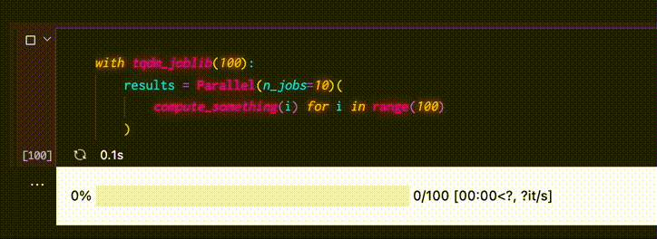

今までは[プログレスバーの記事](./joblib-with-progress-bar)にあるようなちょっとした画面の録画内容を見せたい時はGIF画像を使ってた。

でもGIFって高解像度だと10秒で1MBとかどうも容量が大きくなりがちで、記事に載せるようなレベル感だと高画質にするのは絶対無理なんだよね。

それだけのために帯域が数MB消費されるのも嫌だし😥

そこでGIFの代わりにMP4とかの動画ファイルを直接使ってみたら良い感じ！

画像ホスティングサービスの[GIPHY](https://giphy.com)や[imgur](https://imgur.com)なんかも今ではパフォーマンス的な理由でGIFの代わりに動画ファイルを使ってるみたい。

最近のブラウザは`video`タグで動画の自動再生とインライン再生、コントロールの非表示が簡単に出来るからほぼGIF画像みたいなノリで使えるんだね。

## 比較

まず実際のパフォーマンスを見るために[この記事](./joblib-with-progress-bar)に載せた13秒の動画を`GIF` `MP4` `WebM`3つのフォーマットで比較してみる。

<WarnBox>

iOSのSafariはまだWebMに対応してないからiPhoneやiPadだと表示されないかも。

</WarnBox>

### GIF `145Kb`



### MP4 `44Kb`

<video autoplay loop muted playsinline>
    <source src="../joblib-with-progress-bar/joblib-tqdm.mp4" type="video/mp4; codecs='avc1'" />
</video>

### WebM `33Kb`

<video autoplay loop muted playsinline>
    <source src="../joblib-with-progress-bar/joblib-tqdm.webm" type="video/webm; codecs='vp9'" />
</video>

`GIF`が**145Kb**、`MP4`が**44Kb**ともうこの時点で$\bold{\Large \frac{1}{3}}$**以下**になってる上に画質も圧倒的に良い。

`WebM`に至ってはMP4と変わらないかむしろ良いぐらいの画質で**33Kb**とさすがだなー。

<NoteBox title='WebM'>

Googleが2010年頃から開発・推進してるオープンな動画フォーマット。

Web経由でhtmlに組み込んで表示することを前提としているだけあってかなり軽量なサイズで高画質を実現できる優秀なやつ。

YouTubeの動画などはちょっと前からWebMで配信されてるから意識してなくても既に大多数は利用経験があるはず。

とにかく普及させたいみたいで最初からオープンでロイヤリティフリーを謳ってる。実は`MP4`の`H.264`とかって普通に商用フォーマットだからビジネスに利用すると特許料が発生する可能性があるんだよね。

色々な動画フォーマットが乱立しててスタンダードが定まってないのもこれまで無料で使える高品質なものが無かったっていう理由が大きいみたい。なら俺が作るよ！って作っちゃうのがGoogleのすごいところだよね。

色々なブラウザが次々とWebMに対応する中でiOSだけは長らく非対応の姿勢を貫いてきた。故スティーブ・ジョブズさんが「Googleのコーデックはめちゃくちゃだ」って言ったなんてこともあったみたい。

[Steve Jobs says no to Google's VP8 WebM codec | Apple Insider](https://appleinsider.com/articles/10/05/21/steve_jobs_says_no_to_googles_vp8_webm_codec)

そんなAppleもとうとうiOS 15からなんとWebMの音声コーデックにだけ対応し始めて、映像含めて完全に対応するのも時間の問題っぽそう。

ちなみに画像フォーマット版の`WebP`もあってやはり`JPEG`なんかとは比較にならないぐらい高画質を実現できるよ。こちらは既にiOSでも対応済み。

</NoteBox>

やっぱり`GIF`は画質が悪い上にサイズが大きいのが目立つね。

コスパの悪いGIF画像は動画ファイルに変換して良い感じにしよう！サクッとできるやり方を紹介するよ。

## GIF画像を動画ファイルに変換

まずは手元のGIFを`FFmpeg`を使って動画に変換しよう。

<NoteBox title='FFmpeg'>

動画や音声の加工・変換を行うコマンドラインツールのデファクトスタンダード。

対応してるフォーマットやオプションが異常に多く、これ1つで割とどんな動画も書き出せる。超便利。

[FFmpeg](https://ffmpeg.org)

</NoteBox>

ちなみにここで紹介するやり方は`GIF`だけじゃなくて他の動画ファイルでも同様に使えるよ。

例えばMacでスクリーン録画をすると保存される`MOV`を`MP4`に変換する場合なんかもOK。

### FFmpegのインストールと使い方

MacではHomebrewで簡単にインストールできるよ。Ubuntuでも`apt`で簡単に入れられると思う。

ちょっと前までは色々コーデックのオプションがあったんだけど今はデフォルトで全部入りなのかな？

```shell
brew install ffmpeg
```

基本的な使い方はこう↓

```shell
ffmpeg -i input.gif output.mp4
```

なんとこれだけでファイル名の拡張子から判断して自動的にフォーマットを変換してくれるという便利さ。

詳しい使い方については[FFmpeg](https://ffmpeg.org)のサイトに載ってるんだけど、量が膨大で分かりにくいと思うから大体使いそうな機能をさらっと紹介。

### コーデックの指定

上記の例ように特に何も指定しない場合は元の形式と出力先の関係から自動でコーデックが決定されるっぽいんだけど、それだと意図しないものになっちゃう可能性があるからなるべく指定しよう。

<NoteBox title='コーデック'>

メディアファイルの圧縮・変換方式のこと。

普段意識する`MP4`や`WebM`などのコンテナフォーマットよりさらに細かい概念で、ざっくり言うと`コンテナフォーマット`**=**`映像コーデック`**+**`音声コーデック`って感じ。

だからファイルによってコンテナは同じでもコーデックが違うなんてこともありえるんだね。

拡張子が同じなのに再生できない動画ファイルはコーデックの違いが原因だったりするよ。

ネットが遅くてストリーミングサービスもまだ無いような時代はせっかく時間をかけてダウンロードした動画のコーデックが合わなくて再生出来ない！なんて悲しいこともよくあった😇

</NoteBox>

フォーマット別のおすすめコーデック指定はこんな感じ↓

MP4には`H.264`, WebMには`VP9`が良さそう。

```shell:title=MP4
ffmpeg -i input.gif -c:v libx264 output.mp4
```

```shell:title=WebM
ffmpeg -i input.gif -c:v vp9 output.webm
```

元ファイルがGIFじゃなくて動画のケースでコーデックをそのまま維持したい場合は`-c:v copy`を指定する。

指定しないと入出力のコーデックが同じ場合でも再エンコードされちゃうみたいだから、コーデックを変えずに他の部分だけ変更したい時は`copy`を指定しないといけないね。

### フレームレートの指定

ちょっとした説明用の動画など多少カクカクしても問題ない時はフレームレート(FPS)を下げて容量を節約しよう。

`-r`オプションで1秒あたりのフレーム数を指定できるよ。

これはフレームレートを20にする例。1秒間に20枚のペースってことだね。

```shell:title=MP4
ffmpeg -i input.gif -c:v libx264 -r 20 output.mp4
```

<WarnBox>

元の動画に存在しないタイミングのフレームに対しては単純に時間的に最も近いものが選択されるみたい。

元動画のフレームレートに対して割り切れない数字を指定したりすると場合によっては変な感じのラグがある動画になっちゃうかもしれないから気をつけよう。

</WarnBox>

### 解像度の指定

大きいサイズの元動画を配信用に縮小したい場合なんかは`-s`オプション。

解像度をpx単位で`-s 横x縦`形式で指定して変換することができる。

```shell:title=MP4
ffmpeg -i input.gif -c:v libx264 -s 1280x720 output.mp4
```

**16:9の代表的な解像度**

|        | width | height |   オプション |
| :----- | ----: | -----: | -----------: |
| 8K     |  7680 |   4320 | -s 7680x4320 |
| 4K     |  3840 |   2160 | -s 3840x2160 |
| WQHD   |  2560 |   1440 | -s 2560x1440 |
| FHD    |  1920 |   1080 | -s 1920x1080 |
| WXGA++ |  1600 |    900 |  -s 1600x900 |
| HD     |  1280 |    720 |  -s 1280x720 |

**4:3の代表的な解像度**

|       | width(px) | height(px) |   オプション |
| :---- | --------: | ---------: | -----------: |
| QUXGA |      3200 |       2400 | -s 3200x2400 |
| QXGA  |      2048 |       1536 | -s 2048x1536 |
| UXGA  |      1600 |       1200 | -s 1600x1200 |
| QVGA  |      1280 |        960 |  -s 1280x960 |
| XGA   |      1024 |        768 |  -s 1024x768 |
| SVGA  |       800 |        600 |   -s 800x600 |
| VGA   |       640 |        480 |   -s 640x480 |
| QVGA  |       320 |        240 |   -s 320x240 |
| QQVGA |       160 |        120 |   -s 160x120 |

#### アスペクト比を保ったまま変換

`-vf`オプションを使うと縦横どちらか一方を指定するだけでアスペクト比を保ったまま変換ができる。便利だね。

`-vf scale=横:縦`の形式で自動で設定して欲しいほうに`-1`を指定しよう。

```shell:title=MP4
ffmpeg -i input.gif -c:v libx264 -vf scale=1280:-1 output.mp4
```

### 品質の指定

画質を下げてファイルサイズをなるべく節約したい時もあるよね。

これには`ビットレートから指定する方法`と`品質から指定する方法`の2つあるんだけど、おすすめは品質を指定してビットレートはお任せにするやり方。

品質の指定には`-crf`(Constant Rate Factor)オプションを使おう。

主に圧縮率を調整するものみたいで、低い数字の方が画質が良い(ロスレスに近い)代わりにファイルサイズも大きくなるよ。

`VP9`はデフォルトだとビットレートが最大200Kbpsに制限されてるから併せて`-b:v 0`も指定するようにしよう。

```shell:title=MP4
ffmpeg -i input.gif -c:v libx264 -crf 36 output.mp4
```

```shell:title=WebM
ffmpeg -i input.gif -c:v vp9 -crf 36 -b:v 0 output.webm
```

`H.264`の場合は`-crf`を指定すると固定品質になるんだけど`VP9`は目安って感じで多少変動するみたい。

コーデック別のデフォルト値/最小値/最大値/推奨値はこんな感じ。

| コーデック | デフォルト | 最小 | 最大 | 公式の推奨 |
| :--------- | ---------: | ---: | ---: | ---------: |
| H.264      |         23 |    0 |   51 |      18~28 |
| VP9        |         32 |    0 |   63 |      15~35 |

個人的な目安としては`超高品質=~18` `高品質=~24` `標準品質=~36` `低品質=~44` `超低品質=それ以上`ぐらいだと思う。

#### 範囲で指定する

品質が場面で可変になるように範囲で指定することも出来る。品質に併せて最小値,最大値をそれぞれ`-qmin` `-qmax`で指定すればOK。

`VP9`の変動幅もこのオプションで設定できる。特に固定品質にする理由が無ければ使っておいた方が良さそう。

```shell:title=MP4
ffmpeg -i input.gif -c:v libx264 -crf 36 -qmin 28 -qmax 44 output.mp4
```

```shell:title=WebM
ffmpeg -i input.gif -c:v vp9 -crf 36 -qmin 28 -qmax 44 -b:v 0 output.webm
```

### ピクセルフォーマットの指定

これまで出てきた`コンテナ` `コーデック`に加えてなんと`ピクセルフォーマット`という各ピクセルの色情報についての形式があるんだけど、動画ファイルを変換する時はこれも指定しとかないとスマホで再生できなかったりする。

元がGIF画像の場合は多分気にしないでOKなんだけどね。動画の場合も大抵は`-pix_fmt`オプションで`yuv420p`を指定しておけば大丈夫。

```shell:title=MP4
ffmpeg -i input.mov -c:v libx264 -pix_fmt yuv420p output.mp4
```

## 動画ファイルをWebサイトに表示する

変換した動画をWebサイトに表示するには`video`タグを使おう。

`video`タグの中に`source`を複数入れておくとブラウザが上から順に再生可能かどうかチェックして使ってくれる。これめちゃめちゃ便利！

ここでは優先度順に効率の良い`WebM`, 対応範囲の広い`MP4`, 最後に動画が再生できない場合のフォールバックとして`GIF`を指定してるよ。

```html
<video autoplay loop playsinline muted>
  <source src="video.webm" type="video/webm; codecs='vp9'" />
  <source src="video.mp4" type="video/mp4; codecs='avc1'" />
  
</video>
```

冒頭の比較動画もこのやり方で表示してる。

ポイントは`autoplay` `loop`を指定して自動でループ再生を開始するところと`playsinline`で普通の画像と変わらない埋め込み形式の表示にしているところ。

スマホのブラウザなどは`muted`にしないと自動再生できないからこれも忘れずに指定しておこう。例え無音の動画でも指定しないと再生できないみたい。

<InfoBox title='codecs'>

再生するだけならsourceタグのtype属性にcodecsを書かなくても大丈夫。`type="video/webm"`みたいに省略できる。

変わってくるのはjsで`video.canPlayType()`とかを使う時なんだけど、ここではあんまり関係ないよね。

それでも一応書いておいた方がお行儀が良いからコーデックが分かってる場合はなるべく書くようにしよう。

`VP8`や`VP9`の場合はシンプルに`vp8` `vp9`、`H.264`の場合は`avc1`って書いておけば問題なさそう。

</InfoBox>

## まとめ

やってみたら動画がめっちゃ簡単にhtmlに埋め込めて普通にブラウザの進化を感じた。マジで。時代かー。

ついでにGIF自体についてもちょっと調べたんだけど、元々は単に複数枚の画像を1ファイルに格納するために作られたフォーマットだったみたい。

格納された画像を一連のアニメーションとして表示させるっていうのは副次的な応用方法だったのね。

画像何枚も格納してんなら次々表示を切り替えれば動画っぽく使えるじゃん、みたいな。

しかも`Netscape Navigator 2`の時代からあるやり方らしい。超古い。ネットスケープっていうのは1995年に発表された当時革新的だったブラウザなんだけど、知ってる？笑

当時のブラウザは動画を表示するなんて全然出来なかったはずだし、そんな中で画像ファイル1つでちょっとした動画っぽいものを表示できるとなると確かに超便利だ。

ってかそこまで遡らなくても一昔前まではブラウザで動画を表示するために結構頑張る必要があったんだよね。今となっては嘘みたいだけど。

2000年代でも`Silverlight` `Shockwave` `FLASH`とかのもれなく無くなっちゃった`独立した実行環境をブラウザと連携させて動かす系`のやつでプレイヤーを実装して表示したり、`object`や`embed`とかのタグとしてブラウザが独自実装した機能を使うけど環境依存だから使いにくい上にろくに外部から制御が出来なかったり、そんな感じだった気がする。

YouTubeも確か2015年ぐらいまではFLASHで作ったプレイヤーで動画再生してたんだよね。拡張子が`.swf`のやつ。

それが今では普通に`video`タグ一発😇 もう動画の表示にGIF画像なんて使う必要無いってことなんだろうね。

これからは積極的に動画ファイルを使っていこう。
